# Meshtastic-FIDO — демонстрация интерфейса

Децентрализованная оффлайн-сеть эхоконференций (в духе Fidonet/GoldED) поверх Meshtastic (LoRa).
Ниже — последовательность скриншотов реального прохождения: от первого запуска до чтения дерева переписки в эхоконференции.

---

### 1. Мастер первичной настройки — данные пользователя и выбор устройства

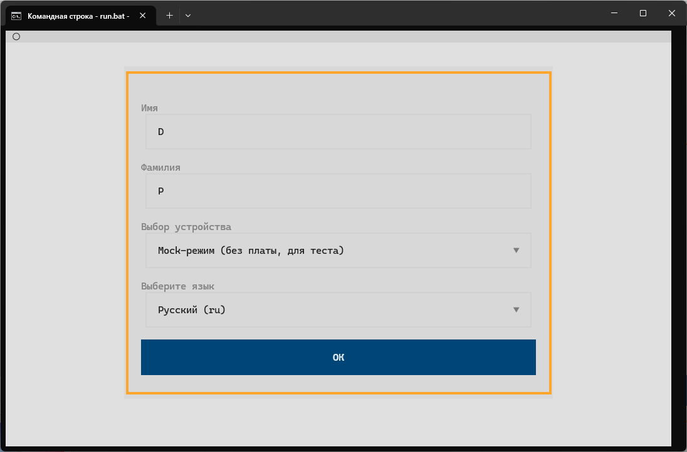

Первый экран при запуске программы: ввод имени/фамилии и выбор устройства (по умолчанию — `Mock-режим`, без платы, для тестирования).

### 2. Выбор способа подключения к плате

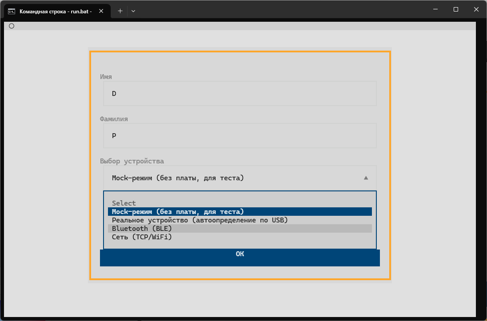

Раскрытый список доступных способов подключения: `Mock-режим` (без платы, для теста), `Реальное устройство` (автоопределение по USB), `Bluetooth (BLE)` и `Сеть (TCP/WiFi)`.

### 3. Подключение к плате по Bluetooth (BLE)

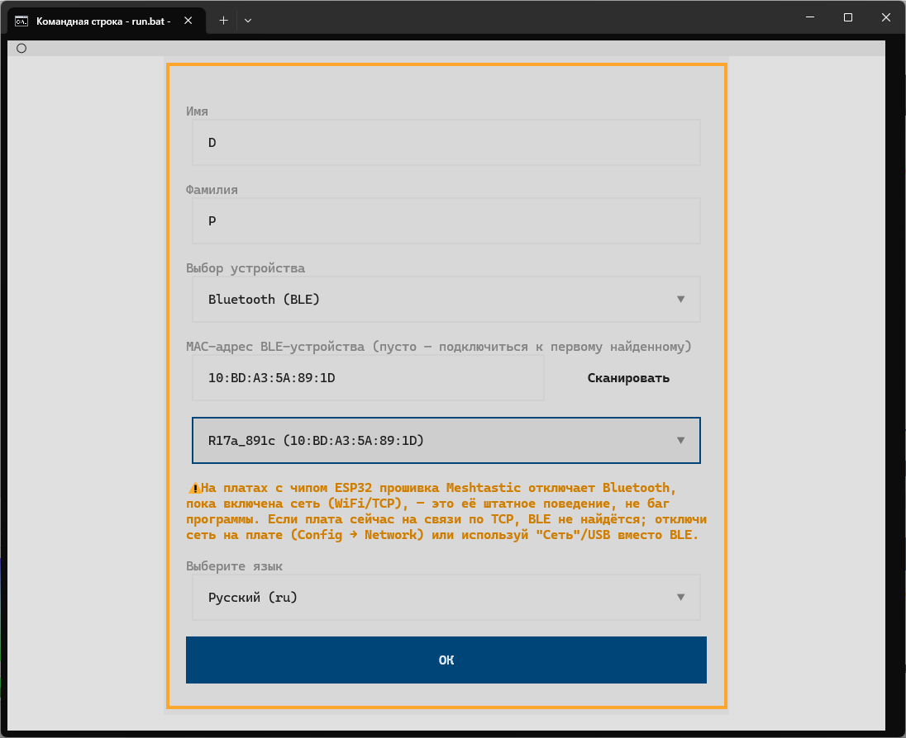

Тот же мастер с выбранным способом подключения `Bluetooth (BLE)`: сканирование эфира, найденная плата `R17a_891c` по MAC-адресу и предупреждение о том, что на платах с чипом ESP32 прошивка Meshtastic отключает Bluetooth, пока включена сеть (WiFi/TCP) — это штатное поведение платы, а не баг программы.

### 4. Политика сети — принятие правил перед входом

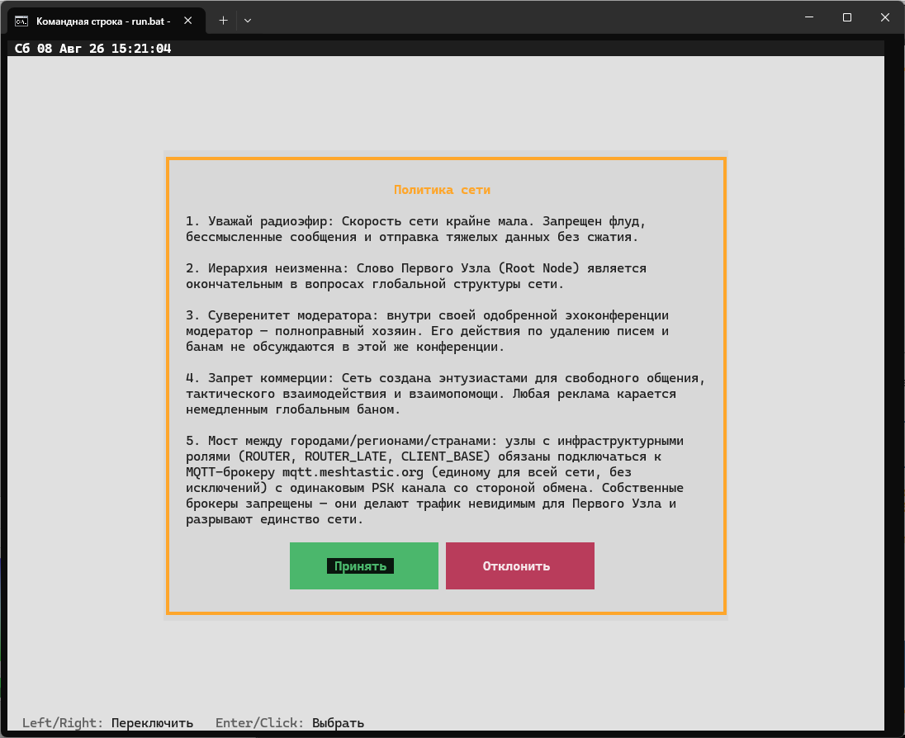

Перед входом в сеть пользователь видит и подтверждает политику сети: уважение к радиоэфиру, неизменность иерархии Root Node, суверенитет модератора внутри своей эхоконференции, запрет коммерции и обязательный единый MQTT-мост (`mqtt.meshtastic.org`, общий PSK) между городами для узлов с инфраструктурными ролями.

### 5. Главный экран — список областей

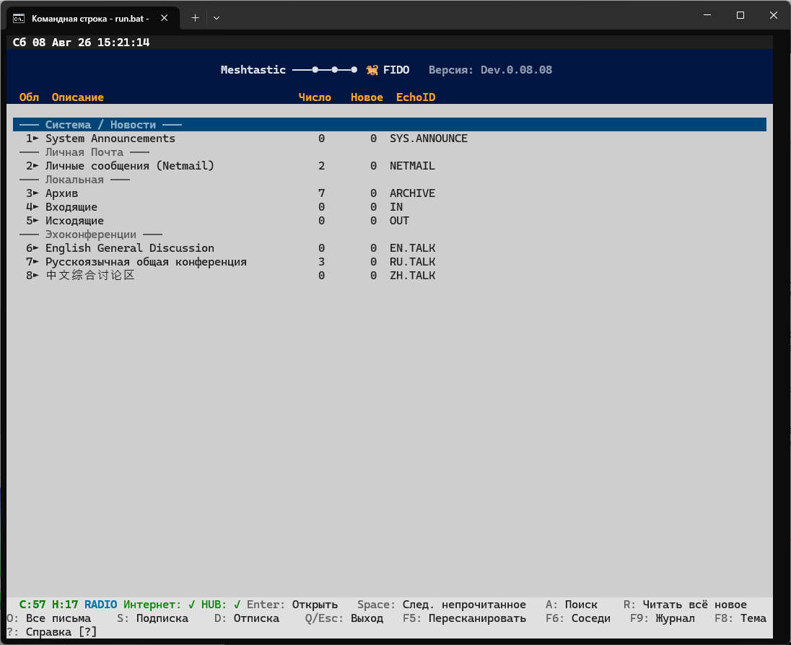
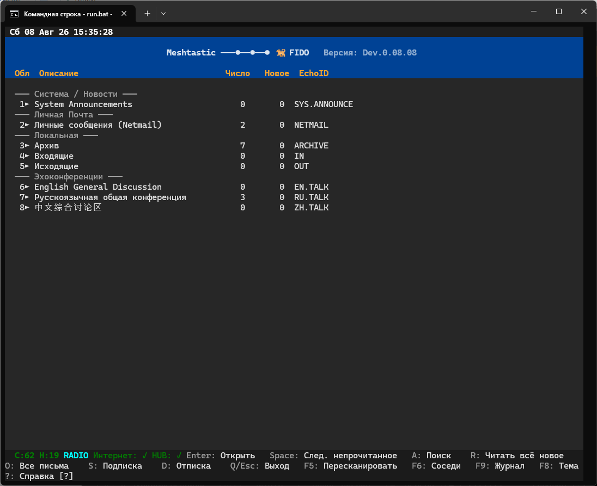

Главный экран приложения в стиле GoldED: служебная область `SYS.ANNOUNCE`, личная почта (`NETMAIL`), локальные папки (`ARCHIVE`/`IN`/`OUT`) и стартовый набор эхоконференций (`EN.TALK`, `RU.TALK`, `ZH.TALK`). Второй скриншот — тот же экран позже в сессии, при возврате к нему из других режимов.

### 6. Список соседних узлов (F6)

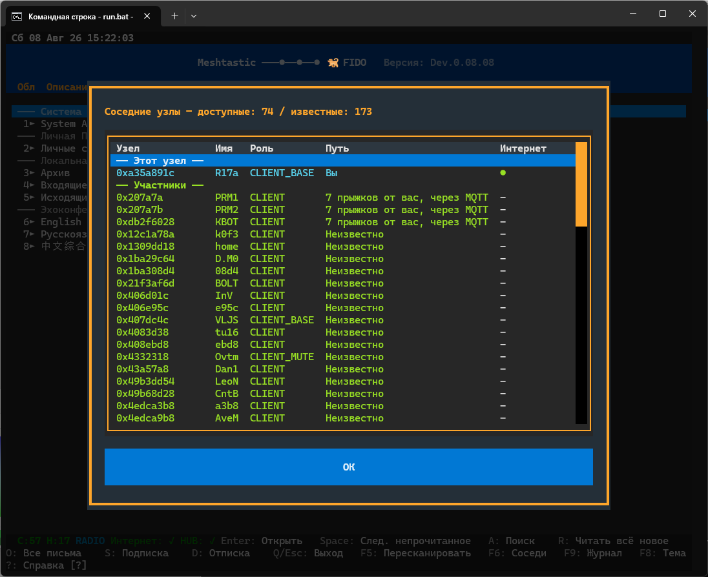

Экран "Соседние узлы" (клавиша F6): счётчик `доступные / известные` в заголовке, собственный узел, узлы-участники (`CLIENT`/`CLIENT_MUTE`/`CLIENT_BASE`) с колонкой "Путь", где число хопов объединено со способом связи (например, «7 прыжков от вас, через MQTT» или «Неизвестно»). У своего узла виден индикатор выхода в интернет.

### 7. Журнал подключения (F9)

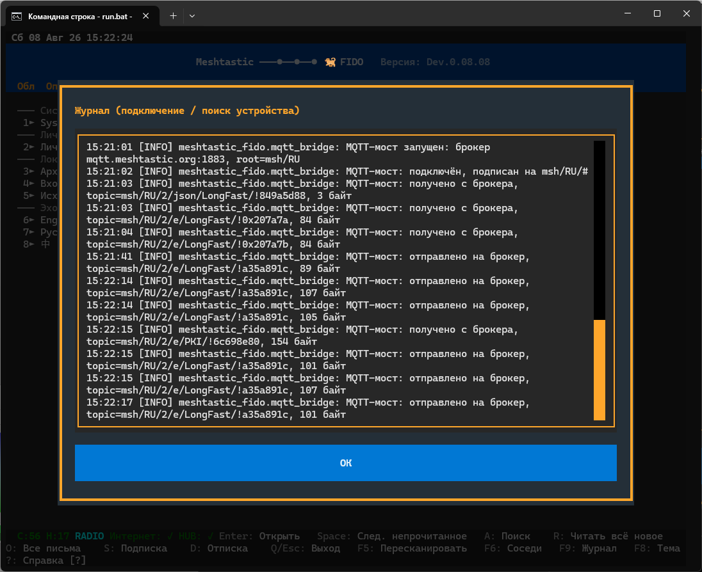

Диагностический журнал подключения (клавиша F9): запуск MQTT-моста к брокеру `mqtt.meshtastic.org`, подписка на `msh/RU/#`, приём и отправка пакетов по топикам `msh/RU/2/e/LongFast/!<id>` (включая шифрованный канал `PKI`) — всё на языке интерфейса.

### 8. Чтение письма — ответ с цитированием

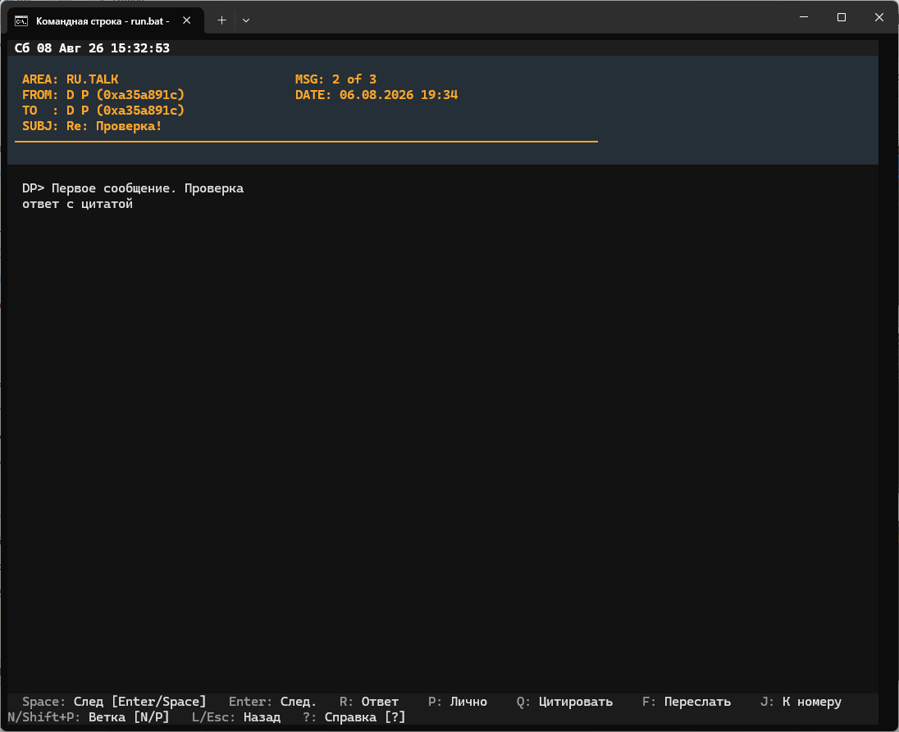

Чтение письма-ответа в эхоконференции `RU.TALK` (2 из 3 в области) — область, отправитель, получатель, дата и тема в шапке, ниже текст с автоматически подставленной цитатой исходного сообщения.

### 9. Написание нового письма в эхоконференцию

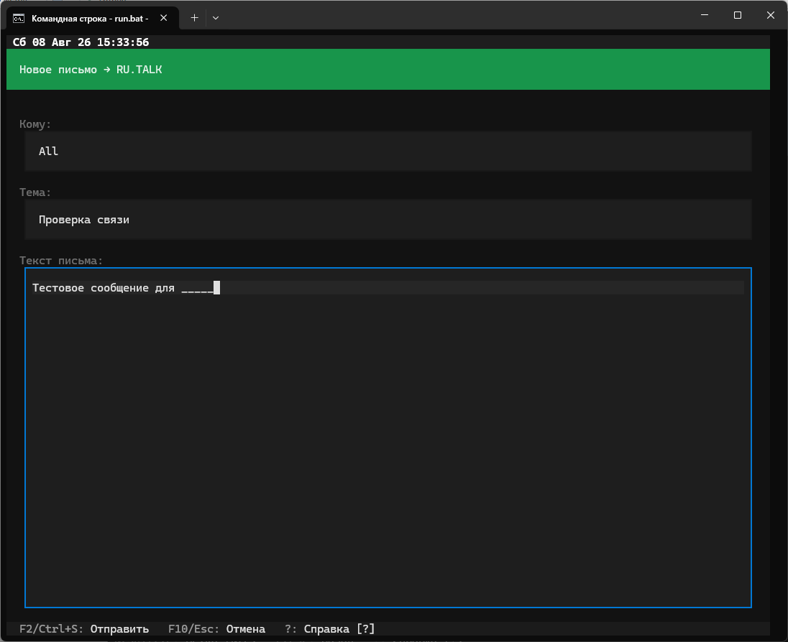

Встроенный редактор для нового письма в эхоконференцию `RU.TALK` — получатель, тема и текст сообщения.

### 10. Дерево переписки (Thread Tree)

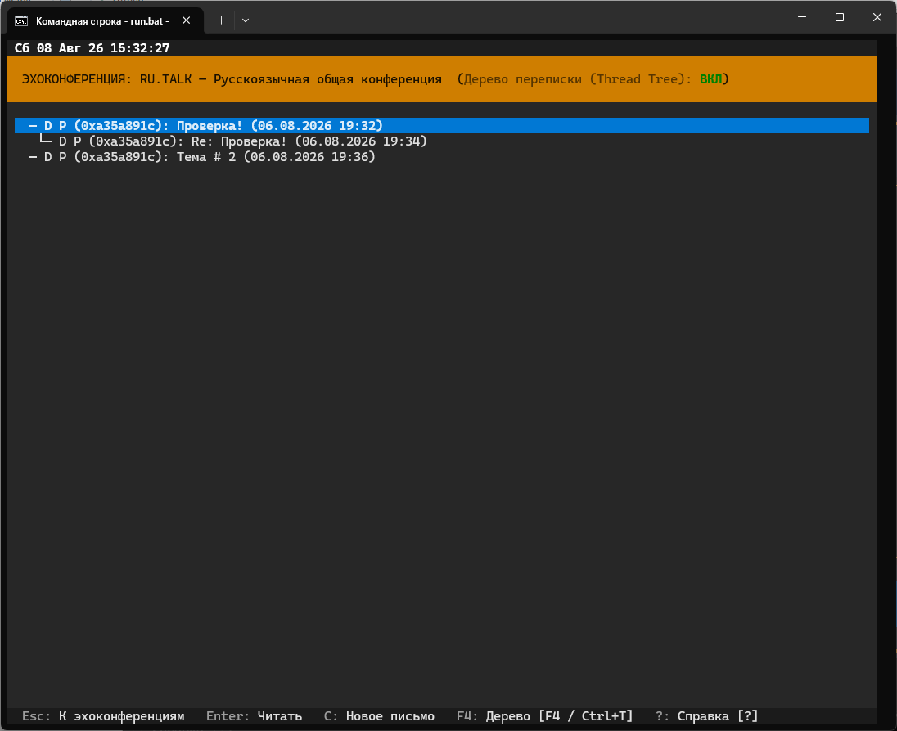

Список писем эхоконференции с включённым режимом "Дерево переписки" (Thread Tree) — ответ визуально вложен под исходное письмо, рядом отдельной веткой отображается вторая, не связанная с первой, тема.

### 11. Встроенная справка — горячие клавиши (часть 1)

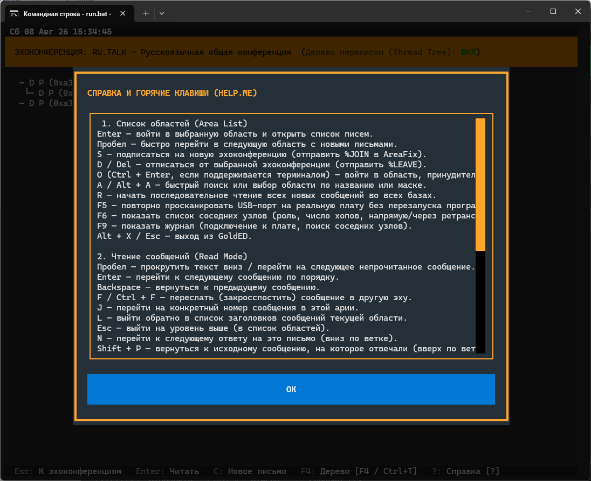

Встроенная справка по горячим клавишам (`?`): навигация по списку областей (включая `F6` — список соседних узлов и `F9` — журнал подключения) и по режиму чтения сообщений.

### 12. Встроенная справка — горячие клавиши (часть 2)

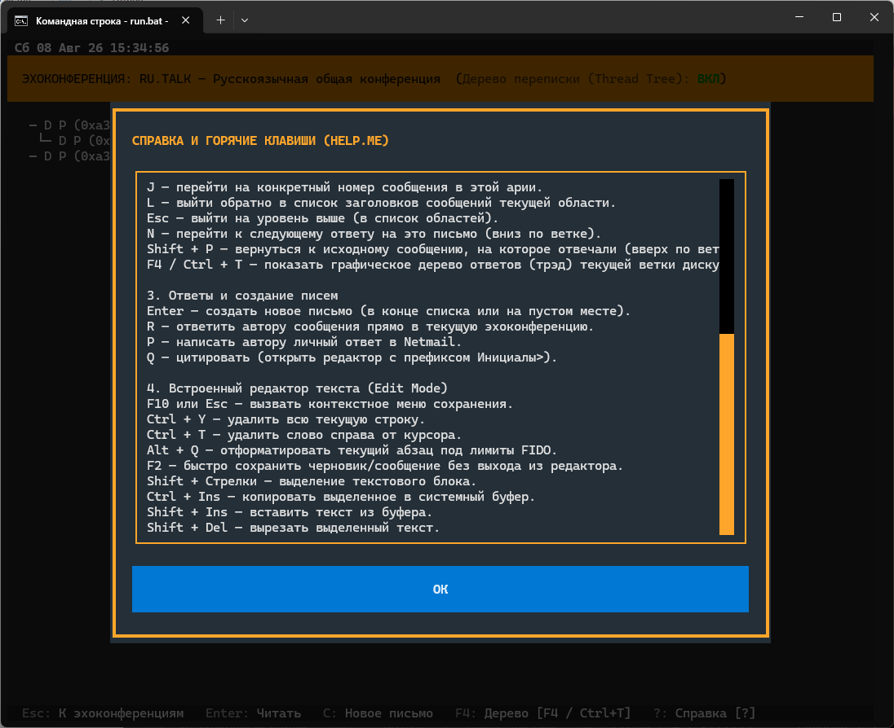

Продолжение справки: создание ответов и писем, а также команды встроенного текстового редактора (форматирование по лимитам FIDO, буфер обмена и т.д.).
