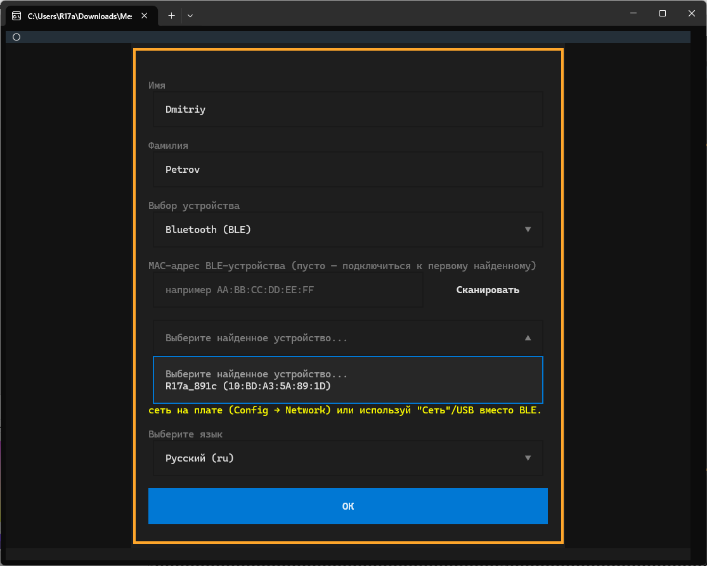
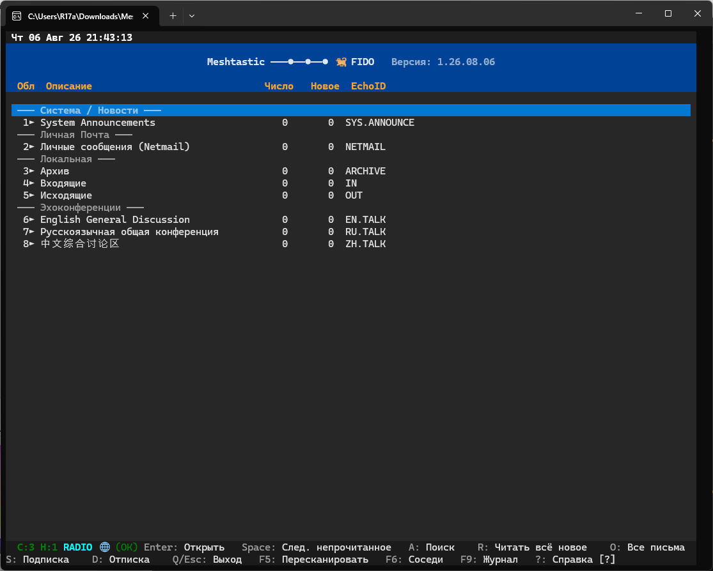
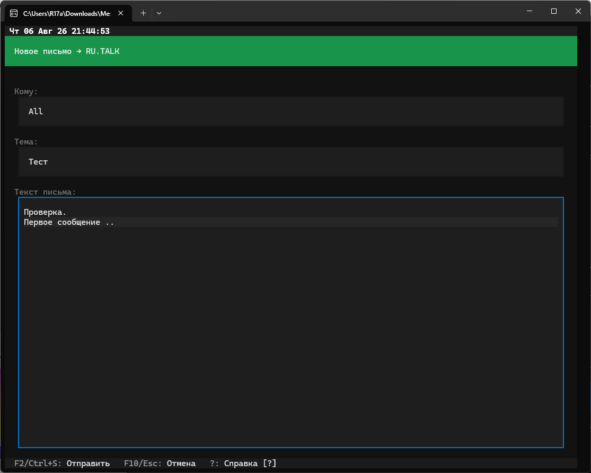

# Meshtastic-FIDO — демонстрация интерфейса

Децентрализованная оффлайн-сеть эхоконференций (в духе Fidonet/GoldED) поверх Meshtastic (LoRa).
Ниже — последовательность скриншотов реального прохождения: от первого запуска до чтения дерева переписки в эхоконференции.

---

### 1. Мастер первичной настройки — данные пользователя и выбор устройства

Первый экран при запуске программы: ввод имени/фамилии, выбор устройства (в том числе `Mock mode` — режим без платы, для тестирования) и выбор языка интерфейса.

### 2. Подключение к плате по Bluetooth (BLE)

Тот же мастер настройки, но с выбранным способом подключения `Bluetooth (BLE)`: сканирование эфира и выбор конкретной найденной платы по MAC-адресу.

### 3. Политика сети — принятие правил перед входом

Перед входом в сеть пользователь видит и подтверждает политику сети: уважение к радиоэфиру, неизменность иерархии Root Node, суверенитет модератора внутри своей эхоконференции, запрет коммерции и обязательный единый MQTT-мост между городами.

### 4. Главный экран — список областей

Главный экран приложения в стиле GoldED: служебная область `SYS.ANNOUNCE`, личная почта (`NETMAIL`), локальные папки (`ARCHIVE`/`IN`/`OUT`) и стартовый набор эхоконференций (`EN.TALK`, `RU.TALK`, `ZH.TALK`).

### 5. Список соседних узлов (F6)

Экран "Соседние узлы" (клавиша F6): собственный узел, узлы-участники (CLIENT/CLIENT_MUTE/CLIENT_BASE) с числом хопов и способом связи (напрямую/ретрансляция), а также отдельно — технические узлы (например, SENSOR). У своего узла виден индикатор выхода в интернет.

### 6. Журнал подключения (F9)

Диагностический журнал подключения (клавиша F9): запуск MQTT-моста к брокеру, поиск и подключение платы по Bluetooth, обнаружение соседних узлов — всё на языке интерфейса.

### 7. Написание нового письма в эхоконференцию

Встроенный редактор для нового письма в эхоконференцию `RU.TALK` — получатель, тема и текст сообщения.

### 8. Чтение отправленного письма

То же письмо в режиме чтения — область, отправитель, получатель, дата и тема в шапке, текст письма ниже.

### 9. Ответ в этой же эхоконференции

Второе письмо в ту же эхоконференцию — специально для проверки последующего отображения дерева переписки.

### 10. Дерево переписки (Thread Tree)

Список писем эхоконференции с включённым режимом "Дерево переписки" (Thread Tree) — ответ визуально вложен под исходное письмо.

### 11. Встроенная справка — горячие клавиши (часть 1)

Встроенная справка по горячим клавишам (`?`): навигация по списку областей и по режиму чтения сообщений.

### 12. Встроенная справка — горячие клавиши (часть 2)

Продолжение справки: создание ответов и писем, а также команды встроенного текстового редактора (форматирование по лимитам FIDO, буфер обмена и т.д.).
