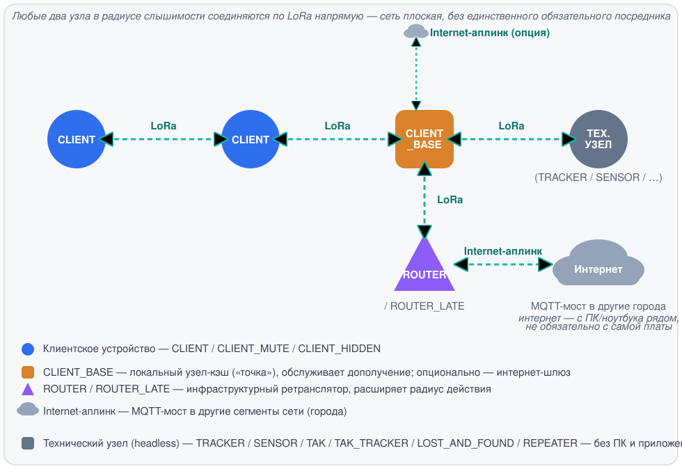
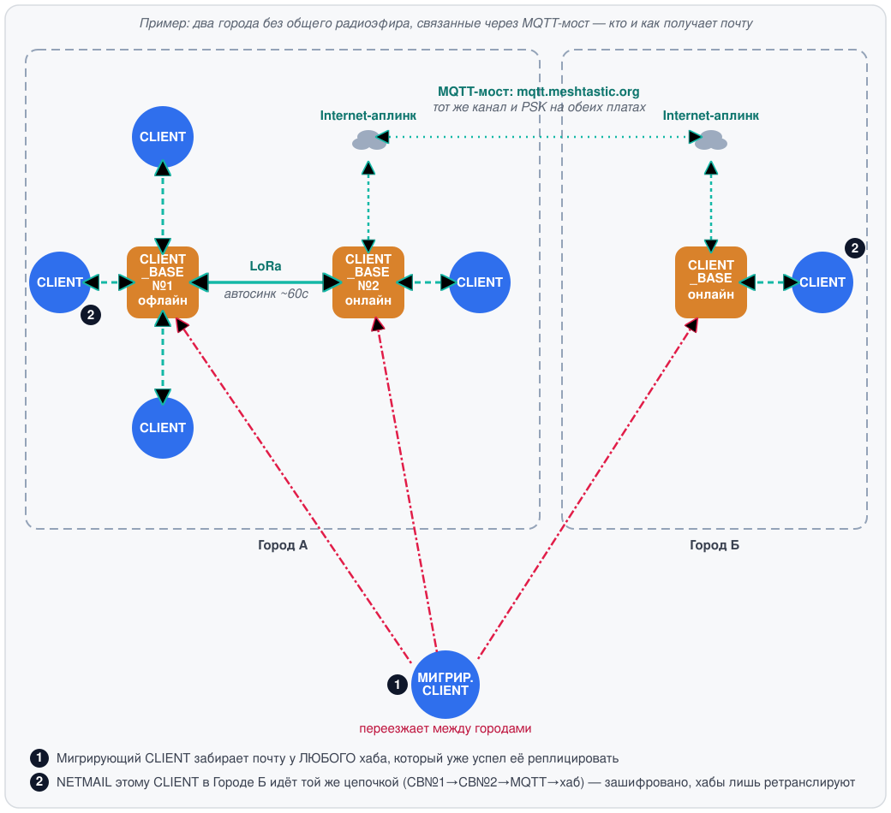
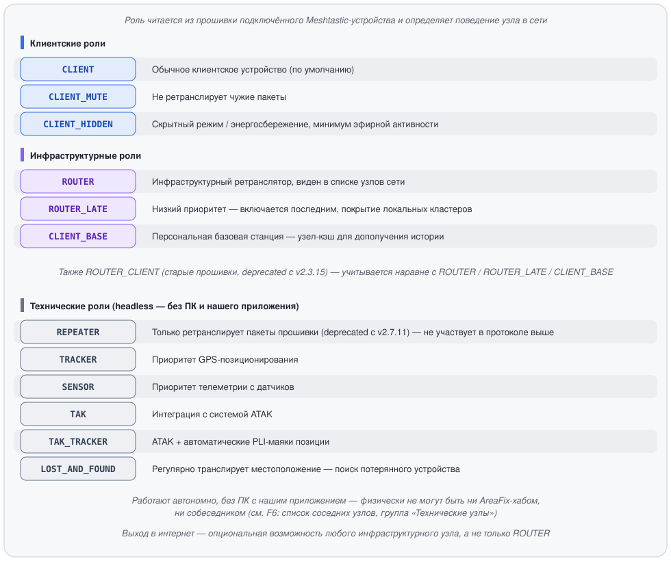
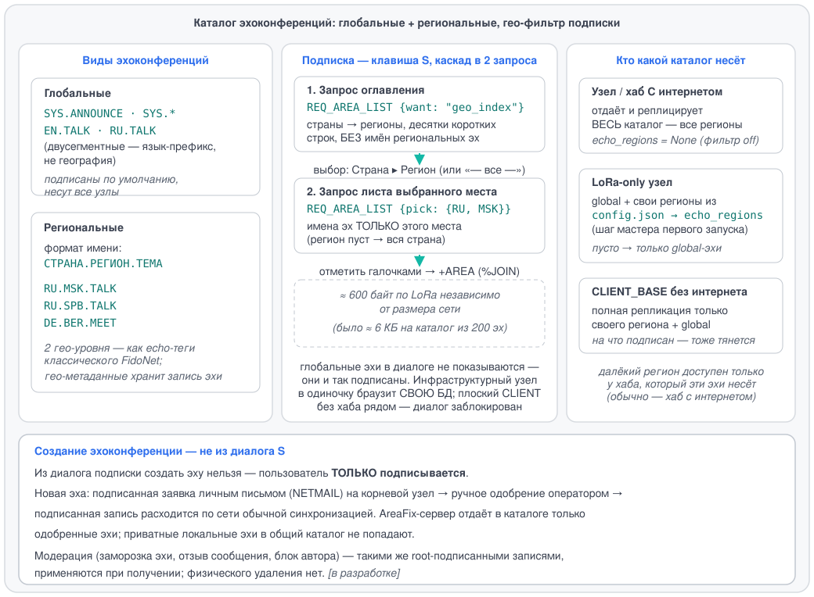
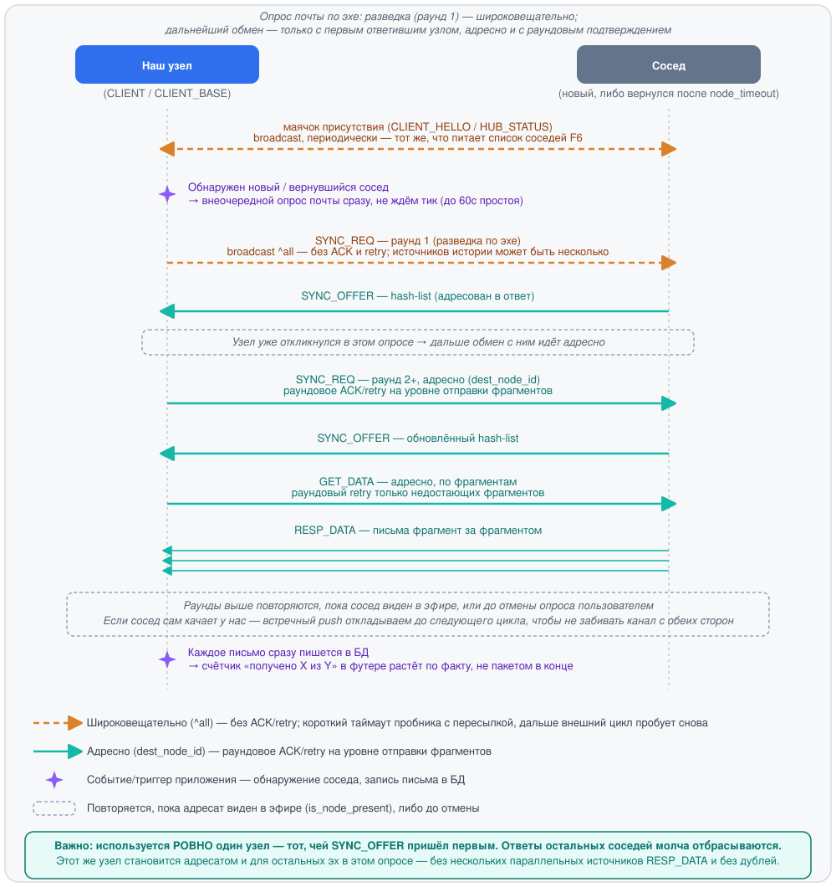
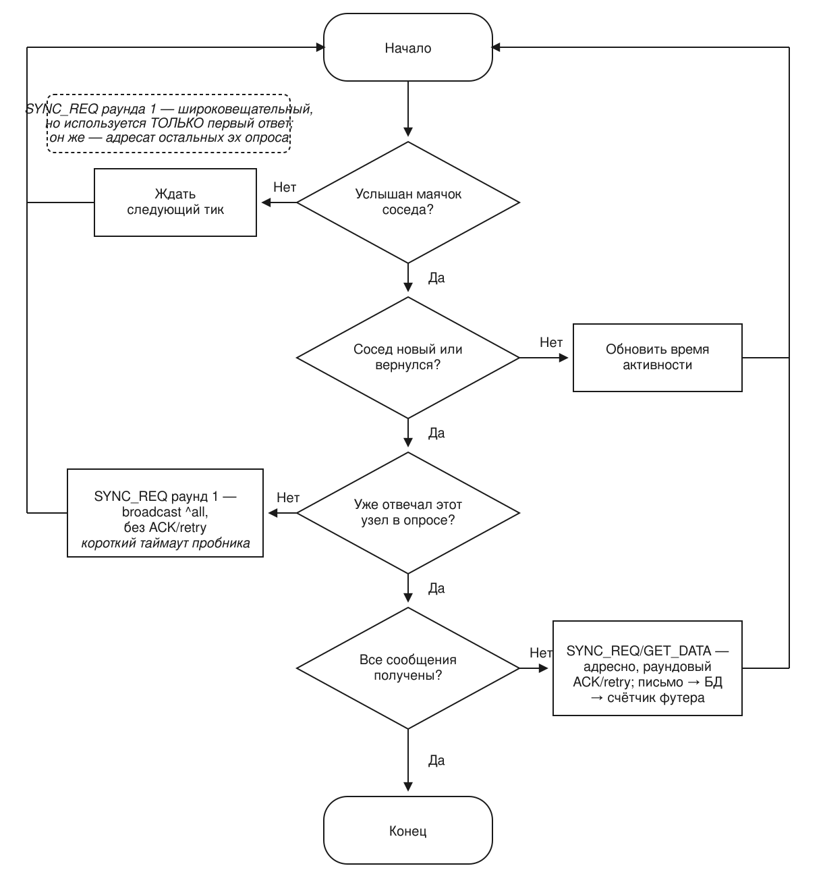

# Meshtastic-FIDO: технология

Meshtastic-FIDO — оффлайн-сеть эхоконференций и личной почты (netmail) в духе
классического FidoNet / редактора GoldED, построенная поверх физического
радиопротокола **Meshtastic (LoRa)**. Сеть не требует интернета и провайдера:
каждый узел хранит сообщения локально, а распространяются они по радиоэфиру
между узлами сети.

> Низкоуровневый бинарный протокол упаковки и фрагментации кадров
> (`PackerEngine`) — собственная разработка и проприетарная часть технологии.
> В этом документе он описан только на уровне назначения и роли в системе,
> без деталей формата кадра, опкодов и алгоритма нарезки.

---

## 1. Типы клиентов

В сети участвует несколько логически разных типов узлов. Физически это одно
и то же TUI-приложение — разница между типами определяется **ролью
устройства** (см. раздел 2) и тем, держит ли узел фоновый сервис раздачи
истории для соседей.

Любые два узла в радиусе слышимости соединяются по LoRa напрямую — сеть плоская,
без иерархии и без единственного обязательного посредника. CLIENT_BASE и ROUTER
выделены на схеме отдельно не потому, что через них обязан идти путь, а потому,
что они дополнительно несут сервисную нагрузку: CLIENT_BASE — кэш истории для
дополучения, ROUTER — приоритетную ретрансляцию, расширяющую охват сети (в т.ч.
до узлов вне прямой досягаемости — через промежуточные ретрансляции по цепочке).

### Обычный клиент (оператор сети)
Стандартный участник: читает и пишет эхопочту и netmail через TUI, подписывается
на эхоконференции и отвечает на сообщения. Работает на «клиентской» роли
устройства (`CLIENT`, `CLIENT_MUTE`, `CLIENT_HIDDEN` — см. раздел 2). Хранит свою
переписку и список подписок в собственной локальной базе. Связывается по LoRa
напрямую с любым другим узлом сети в радиусе слышимости — с таким же обычным
клиентом точно так же, как с `CLIENT_BASE` или `ROUTER`.

### Технические узлы — без нашего приложения (`REPEATER`, `TRACKER`, `SENSOR`, `TAK`, `TAK_TRACKER`, `LOST_AND_FOUND`)
Эти роли headless: устройство работает автономно (часто на батарее или
солнечной панели), без постоянно подключённого ПК, и физически не может
запускать наше приложение. Такой узел никогда не будет ни собеседником, ни
AreaFix-хабом — он только передаёт или собирает данные на уровне самой
прошивки Meshtastic (ретрансляция пакетов, GPS/телеметрия, интеграция с
ATAK). В списке соседних узлов (клавиша **F6**) такие узлы визуально отделены
от участников сети отдельной серой группой «Технические узлы».

### Локальный узел-кэш / «точка» (`CLIENT_BASE`)
То же TUI-приложение, но на устройстве с ролью **`CLIENT_BASE`**, которое
физически остаётся включённым продолжительное время. Такие узлы держат
фоновый сервис раздачи истории эхоконференций и обслуживают дополучение
пропущенных сообщений соседними клиентами, вернувшимися в эфир. Это
ближайший аналог «поинта» в терминологии FidoNet. Выход в интернет для
такого узла не обязателен, но и не запрещён — см. ниже.

Помимо раздачи своих подписок соседям, `CLIENT_BASE` дополнительно активно
зеркалирует ПОЛНЫЙ каталог других встреченных `CLIENT_BASE` — не только эхи,
на которые он сам подписан. Перед обычным обходом подписок такой узел
запрашивает у соседнего инфраструктурного узла его полный список эх и
заводит у себя те, которых раньше не знал вовсе — дальше они реплицируются
тем же двусторонним механизмом, что и обычные подписки. Обычный `CLIENT`
это не делает — он, как и раньше, дополучает историю только по тому, на что
сам подписан.

### Инфраструктурный узел-ретранслятор (`ROUTER` / `ROUTER_LATE`)
Расширяет радиус действия сети, ретранслируя пакеты дальше, в т.ч. до узлов
вне прямой досягаемости.

### Интернет-аплинк — необязательная возможность любого инфраструктурного узла
Выход в интернет не привязан к конкретной роли: как `ROUTER`/`ROUTER_LATE`,
так и `CLIENT_BASE` могут дополнительно иметь доступ в интернет, наравне с
ретранслятором. Отсутствие интернета не мешает узлу выполнять свою основную
роль (раздача истории для `CLIENT_BASE`, ретрансляция для `ROUTER`).

Мост между разрозненными сегментами сети (например, между городами, где нет
общего радиоэфира) — это отдельная возможность поверх интернет-аплинка,
через встроенный в прошивку Meshtastic MQTT client proxy: узел делегирует
подключение к MQTT-брокеру этому приложению (у платы обычно нет своего
WiFi/IP), а сама плата публикует/принимает эфирные пакеты через тот же
serial-канал. Мост работает СТРОГО НИЖЕ протокола эхоконференций — формат
кадра и фрагментация не меняются вообще, просто пакеты дополнительно
ретранслируются через брокер вместо (или вместе с) радиоэфиром. Требует
одинаковых настроек брокера и ключа канала на обеих сторонах — настраивается
на самой плате (официальное приложение/CLI Meshtastic), не этим приложением.
По умолчанию используется общий публичный брокер `mqtt.meshtastic.org`; если он
перегружен посторонним трафиком (это общий брокер всей сети Meshtastic, не только
Meshtastic-FIDO), можно использовать менее загруженный брокер проекта — данные для
подключения см. в `helpme.md`, раздел 9. Обе стороны моста должны совпадать по
брокеру для прямого MQTT-обмена, но разный выбор брокера не разрывает сеть в целом —
узлы всё равно находят друг друга через DHT/Relay (см. ниже).

**Практическое следствие (подтверждено на реальном железе, 2026-08-06):**
реальное TCP-соединение к брокеру держит именно ЭТО ПРИЛОЖЕНИЕ — то есть
устройство, на котором оно запущено (ноутбук, ПК), а не сама LoRa-плата:
у большинства плат нет собственного WiFi-модуля с выходом в интернет вообще.
Значит, для получения свежих сообщений через мост достаточно, чтобы РЯДОМ
с платой (по USB/BLE/локальной сети) оказался любой компьютер с интернетом —
вплоть до телефона в режиме точки доступа (мобильный хот-спот). Состояние
WiFi самой платы тут ни при чём; более того, на платах с ESP32 включённая
сеть на самой плате отключает Bluetooth на уровне прошивки (подтверждено
официальной документацией Meshtastic, см. helpme.md), так что для этого
сценария сеть на плате как раз разумно держать выключенной, а интернет
носить с собой отдельно — например, подключаясь к плате по BLE.
**Важно:** BLE у платы держит ровно одно подключение одновременно — если
плата в этот момент уже подключена по BLE к телефону (например, открыто
официальное приложение Meshtastic), это приложение её по BLE не найдёт и не
подключится, пока телефон не отключится (см. helpme.md, раздел 3/7).
**Важно про PIN:** если у платы включён режим `Bluetooth → PIN-код`
(`RANDOM_PIN`/`FIXED_PIN`, не `NO_PIN`), сопряжение по PIN нужно выполнить
средствами самой операционной системы (Windows/macOS/Linux — системные
настройки Bluetooth) ДО подключения из приложения — своего поля для ввода
PIN у него нет (см. helpme.md, раздел 3).

**Мигрирующий CLIENT и репликация между городами (подтверждено, 2026-08-06):** если
у CLIENT_BASE в разных городах был интернет и мост поднимался (см. выше), между
ними уже прошла двусторонняя anti-entropy-репликация — и тогда CLIENT,
оказавшийся позже рядом по радио с ЛЮБЫМ из этих узлов В ДРУГОМ ГОРОДЕ, заберёт
то, что успело реплицироваться, даже если у ЭТОГО КОНКРЕТНОГО узла интернета в
момент встречи уже нет. Важна не текущая, "прямо сейчас" доступность интернета у
встреченного узла, а то, была ли у него возможность синхронизироваться заранее:
интернет в момент встречи — сильный сигнал свежести (значит, узел мог обновиться
только что), но не единственное условие получения актуальной почты — заранее
реплицированный, но временно офлайн узел способен отдать её точно так же.

**Условия, при которых цепочка выше реально работает (важные оговорки,
2026-08-06):**

- **Приложение должно быть запущено на каждом промежуточном хабе.** Вся эта
  логика (`AreaFixServer`, `MqttBridge`, периодический опрос) живёт в самом
  TUI-приложении, а не в прошивке платы — выключенный/незапущенный хаб не
  ретранслирует ничего, независимо от того, что написано в его роли.
- **Доставка не мгновенна.** Она идёт хопами: клиент → ближайший хаб → сосед
  этого хаба по локальному эфиру → мост → хаб в другом городе → его клиент —
  и на каждом хопе свой цикл опроса (периодический раз в ~60 секунд или
  немедленный при ручном входе в эху/NETMAIL). Несколько хопов — это, как
  правило, минуты, а не секунды.
- **NETMAIL (личная почта) реплицируется ТЕМ ЖЕ механизмом, что и обычная
  эхоконференция** — полной репликацией между узлами, обменивающимися
  историей, а не адресной маршрутизацией до получателя. Хабы на пути хранят
  и ретранслируют личные сообщения наравне со всеми остальными, включая
  чужие — приватность обеспечивает end-to-end шифрование (получатель
  расшифровывает своим ключом), а не то, что письмо "проходит мимо" узлов,
  которым не адресовано.
- **Но обмен между хабом и обычным клиентом при опросе почты — адресный, не
  полный.** Когда обычный `CLIENT` спрашивает у соседнего узла "есть ли новая
  почта", по NETMAIL он получает только письма, адресованные ему самому — не
  весь кэш личной почты, который хаб хранит ради полной репликации между
  хабами (см. пункт выше). Метаданные чужих писем (тема, отправитель, дата) —
  не только зашифрованное тело — такому клиенту не передаются вовсе.
- **Оба CLIENT_BASE моста должны быть настроены на один и тот же канал/PSK и
  один и тот же брокер** (`mqtt.meshtastic.org` или брокер проекта, см. выше) —
  без этого условия города просто не услышат друг друга через мост, независимо
  от остальных условий (но найдут друг друга через DHT/Relay ниже — медленнее,
  чем прямой мост, но без этой ручной настройки).

### Резервный путь для узлов без общего MQTT-канала — DHT-обнаружение и релей
MQTT-мост выше требует ручной предварительной настройки — оба CLIENT_BASE должны
заранее знать один и тот же канал/PSK. Для узлов, у которых такой договорённости
нет (или она ещё не появилась), приложение умеет находить друг друга и обмениваться
почтой другим путём, полностью независимым от прошивки платы и её MQTT-прокси —
через обычный интернет-канал самого компьютера, на котором оно запущено.

Обнаружение построено поверх уже существующей, десятилетиями работающей
публичной сети (та же технология, что используют торрент-клиенты для поиска
раздач без центрального сервера) — узлы находят друг друга по общему
идентификатору сети, не публикуя при этом ничего о содержимом переписки: сама
DHT используется исключительно как справочник «кто ещё в сети и по какому
адресу его искать», обмен почтой как и раньше идёт напрямую между узлами по
собственному протоколу приложения.

Найдя друг друга, узлы пробуют связаться напрямую по TCP/IP. Если это не
получается — типичная ситуация, когда оба узла находятся за домашним
роутером или мобильным интернет-провайдером без внешнего IP-адреса
(NAT/CGNAT) — используется вспомогательный сервер-посредник: оба узла
подключаются к нему исходящим соединением (это работает почти всегда, даже
там, где входящие соединения заблокированы) и он просто пересылает между
ними те же самые зашифрованные/подписанные пакеты, не имея доступа к их
содержимому сверх того, что видел бы любой промежуточный узел на пути письма
по радиоэфиру.

**Включённый VPN на компьютере/роутере мешает именно этому прямому пути** —
программа определяет свой видимый снаружи адрес, чтобы найти себя в DHT-выдаче и не
пытаться дозвониться сама до себя; при активном VPN этот адрес оказывается адресом
VPN-сервера, а не тем, где реально слушает узел, и прямое соединение может не
устанавливаться или работать медленнее. Для полевых испытаний этого пути VPN лучше
на время выключать; на радио и MQTT-мост это не влияет.

Этот путь не заменяет MQTT-мост (у него другая роль — оперативный обмен
между заранее сдружившимися городами) и не требует какой-либо ручной
настройки со стороны обычного пользователя — при наличии интернета он
работает автоматически, в фоне, как дополнительная возможность найти
собеседников за пределами прямой радиодосягаемости.

### Обнаружение в локальной сети — без интернета вообще
Отдельно от описанного выше DHT/релей-пути (обоим нужен интернет-канал),
приложение также умеет находить соседей внутри одной локальной сети —
например, в офисе или учреждении, где несколько узлов подключены к общей
проводной или Wi-Fi-сети. Такое обнаружение не требует интернета вообще и не
зависит от DHT: узлы просто анонсируют себя рассылкой в пределах локальной
сети и сразу находят друг друга. Если в этой же локальной сети есть узел с
выходом в интернет, он естественным образом становится мостом — синхронизируясь
и с соседями внутри сети, и с остальным миром через DHT/релей, и перенося
почту между обоими мирами тем же двусторонним механизмом, что и везде в сети.

---

## 2. Роли клиентов (Meshtastic `Config.DeviceConfig.Role`)

Роль читается из прошивки подключённого Meshtastic-устройства и определяет
поведение узла в сети:

### Как роль влияет на поведение сети
- Каждый узел — клиентский или инфраструктурный — самостоятельно хранит свою
  переписку и список подписок в собственной локальной базе. Подписка на
  эхоконференцию — решение самого клиента, а не разрешение, которое нужно
  у кого-то спрашивать.
- Инфраструктурные узлы (`ROUTER`, `ROUTER_LATE`, `CLIENT_BASE`) дополнительно
  держат историю эхоконференций и раздают дополучение пропущенных сообщений
  вернувшимся в эфир соседям. Такой сервис поднимается независимо на каждом
  инфраструктурном узле: клиент не привязан к одному конкретному узлу — если
  один недоступен, историю можно дополучить у любого другого в радиусе.
- Индикатор `[H]`/`[C]` в интерфейсе отражает, ведёт ли себя текущий узел как
  инфраструктурный или как обычный клиент; счётчики видимых соседей
  показывают, сколько вокруг узлов каждого типа.
- Список доступных эхоконференций клиент получает от любого доступного
  инфраструктурного узла — не обязательно от одного и того же (с учётом
  гео-фильтра, см. ниже).

### Каталог эхоконференций: география подписки

Эхоконференции делятся на **глобальные** и **региональные**. Глобальные —
`SYS.*` и языковые (`RU.TALK`, `EN.TALK`): подписаны у всех по умолчанию и
хранятся на каждом узле. Региональные именуются по схеме
`<СТРАНА>.<РЕГИОН>.<ТЕМА>` (`RU.MSK.TALK`, `DE.BER.MEET`) — два географических
уровня, примерно как echo-теги классического FidoNet. Гео-принадлежность —
часть записи самой эхи, а не только её имени.

**Подписка (клавиша `S`) идёт через каталог хаба** и построена как каскад из
двух коротких запросов, чтобы не тянуть по LoRa список из сотен чужих
городов: сначала узел запрашивает «оглавление» (список стран и регионов —
десятки коротких строк без имён эх), затем — имена эх только для выбранного
места. Отмеченные галочками эхи добавляются в подписку (`+AREA` / `%JOIN`).
Трафик по LoRa — сотни байт вместо килобайтов, независимо от размера сети.
Глобальные эхи в диалоге не показываются (они и так подписаны); плоскому
`CLIENT` без инфраструктурного узла в радиусе браузить нечего — диалог в этом
случае заблокирован, а инфраструктурный узел показывает каталог из
собственной базы.

**Какие регионы интересны узлу — задаётся в `config.json` (`echo_regions`,
шаг мастера первого запуска).** Фильтр применяется **только у узла без
интернета**: узел с интернетом всегда получает и раздаёт полный каталог всех
регионов (интернет-хабы намеренно берут на себя полную репликацию). У
LoRa-only узла пустой список означает «только глобальные эхи». `CLIENT_BASE`
без интернета аналогично реплицирует лишь свой регион и глобальные эхи плюс
то, на что подписан вручную. Чтобы подписаться на далёкий регион, нужен хаб,
который эти эхи физически несёт (как правило — хаб с интернетом): хаб своего
же региона по радио их просто не хранит.

**Создать эхоконференцию из диалога подписки нельзя** — пользователь только
подписывается. Заведение новой эхи — отдельный процесс с ручным одобрением
оператора корневого узла: подписанная заявка уходит личным письмом (NETMAIL)
на корневой узел, оператор одобряет или отклоняет, и подписанная запись
расходится по сети обычной синхронизацией; в общий каталог попадают только
одобренные эхи. Тем же механизмом подписанных записей работает модерация
(заморозка эхи, отзыв сообщения, блок автора) — она применяется при
получении, без физического удаления. Этот процесс в разработке.

---

## 3. Передача данных (общий контур)

> **Коротко:** появление соседа в эфире запускает широковещательный вопрос
> «у кого есть почта по этой эхе» (раунд 1) — это разведка, а не приветствие
> одному конкретному узлу, и ответить может не один сосед, а сразу несколько.
> Но используется **только первый** пришедший ответ — остальные молча
> отбрасываются, дальнейший обмен (раунды 2+, включая по другим эхам этого же
> опроса) идёт адресно с этим одним узлом. Так исключается ситуация, когда
> несколько CLIENT_BASE параллельно шлют одну и ту же историю дважды.

Сообщения (эхопочта, netmail, служебные команды) перед выходом в эфир
проходят через единый конвейер упаковки и фрагментации (`PackerEngine`),
приводящий их к ограничениям MTU радиоканала LoRa и разбирающий обратно на
приёме — по одному и тому же пути для любых сообщений, без особых случаев.

Сеть децентрализована на уровне доставки: живые сообщения распространяются
широковещательной ретрансляцией по эфиру, без привязки к одному конкретному
узлу. Дополучение пропущенной истории — тоже двустороннее: когда два узла
встречаются в эфире (например, клиент, какое-то время работавший без
доступного инфраструктурного узла, встречает такой узел или другого клиента),
они обмениваются недостающими сообщениями в обе стороны, а не только
«клиент тянет у хаба» — каждый отдаёт то, чего нет у собеседника, и получает
то, чего нет у себя. Обслуживать дополучение может любой доступный
инфраструктурный узел, а не единственный фиксированный.

Между двумя инфраструктурными узлами этот встречный обмен ещё и разнесён по
времени: пока один тянет историю у другого, встречный push второй стороны
придерживается и досылается уже следующим циклом. Так две базовые станции не
забивают полудуплексный радиоканал одновременным потоком с обеих сторон
(из-за чего под встречным шквалом раньше могла надолго вставать очередь
передачи); отметка «сосед сам качает» протухает сама, и если ему всё ещё
чего-то не хватает — следующий цикл это дошлёт.

Появление нового или вернувшегося в эфир соседа (через служебный маячок
присутствия, тот же, что питает список соседей на **F6**) сразу запускает
внеочередной опрос почты — вместо ожидания ближайшего периодического цикла (до
минуты простоя без причины). Этот маячок — не разовое «представление» новому
узлу, а постоянный фоновый сигнал: оба узла шлют его друг другу периодически,
пока находятся в эфире, а обнаружение нового/вернувшегося соседа — это просто
триггер, обработанный по факту прихода такого маячка.

При штатном выходе узел напоследок шлёт тем же маячком отметку «ухожу»,
чтобы соседи убрали его из списка **F6** сразу, а не держали ещё несколько
минут по таймауту молчания (в Meshtastic нет пакета «отключился», поэтому
уход обычно определяется именно по тишине). Если этот прощальный маячок
потерян в эфире, срабатывает прежний таймаут — узел просто исчезнет чуть
позже. Столбец способа связи в **F6** показывает транспорт последнего
принятого от узла кадра нашего протокола (радио, MQTT, прямое
интернет-соединение или релей), а не запись из памяти платы, которая
может устареть; индикатор «Интернет: ✓» в футере загорается при любом
рабочем интернет-канале — и через MQTT-мост, и через прямое
соединение/DHT (см. ниже).

Первый запрос синхронизации по каждой эхе (разведка, ещё нет подтверждённого
контакта) сознательно остаётся широковещательным ("^all") — источников истории
может быть несколько, и уровень репликации у разных инфраструктурных узлов
отличается, поэтому нет смысла спрашивать только одного заранее выбранного
соседа. Ответить на этот широковещательный вопрос может не один сосед, а сразу
несколько — но используется **только первый** пришедший ответ: остальные
SYNC_OFFER, даже если они всё же долетели, просто отбрасываются без обработки.
Дальнейший обмен в рамках этого опроса — раунды 2+, `GET_DATA`, `RESP_DATA` —
идёт адресно и только с этим одним узлом, а не с несколькими параллельно. На
реальном радио это правило распространяется даже шире одной эхи: как только
хоть один сосед ответил, он становится адресатом разведки и для остальных
подписанных эх этого же опроса — вместо того чтобы для каждой эхи заново ждать
полный таймаут широковещательного ответа.

Сам этот широковещательный пробник ждёт ответа недолго — порядка интервала
маячка присутствия, а не длинного таймаута, рассчитанного на многофрагментный
ответ с письмами (ответ на пробник всегда однофрагментный). Если за это время
(с несколькими пересылками пробника внутри) никто не отозвался, внешний цикл
опроса быстро пробует снова и чаще застаёт соседа в момент, когда тот
освободился от передачи.

Более того, сама эта адресная разведка по остальным подпискам объединяется в
ОДИН запрос вместо отдельного round-trip'а на каждую эху: список эх уходит
одним `SYNC_REQ` и возвращается одним `SYNC_OFFER` с офером по каждой из них
внутри. Число раунд-трипов на разведку перестаёт линейно расти с числом
подписок — пять подписанных эх это один общий запрос-ответ, а не пять
последовательных ожиданий радио-round-trip'а подряд. Батчится только сама
разведка «у кого что есть»; последующая адресная докачка каждой эхи с
недостающими сообщениями (`GET_DATA`/`RESP_DATA`) остаётся отдельной для
каждой эхи, как и раньше.

Это осознанное решение, а не побочный эффект: тяжёлый трафик (`RESP_DATA`,
фрагменты писем) физически поступает из одного источника за раз, поэтому
несколько CLIENT_BASE с одинаковой историей эхи RU не начнут одновременно
слать одни и те же новые сообщения и не задвоят эфирный трафик. Дополнительная
подстраховка на случай дублирования (например, письмо пришло через
дозагрузку в одном раунде и одновременно было отдано соседом в порядке
двусторонней репликации по другой цепочке) — запись в базу по `msg_id`
происходит с игнорированием повторов (`INSERT OR IGNORE`), так что дубликат
просто не будет сохранён второй раз, даже если бы всё же дошёл.

Помимо самой упаковки и фрагментации, этот же конвейер экономит эфирное время
и устойчив к перегрузке канала: сжатие с учётом специфики протокола, порядок
отправки при заторе эфира, защита от повторной ретрансляции одного и того же
пакета по кругу и компактные представления больших списков истории — как и
формат кадра, детали этих механизмов остаются частью закрытой реализации
`PackerEngine` и здесь не раскрываются.

Для адресной (не широковещательной) отправки многофрагментных сообщений
недостающие после раунда подтверждения фрагменты довыборочно досылаются — не всё
сообщение заново, а именно то, что не подтвердилось, — пока адресат виден в эфире
или пока пользователь не прервёт опрос почты вручную. Подробности — `helpme.md`,
раздел 13.

Как именно узел распределяет фрагменты одного кадра во времени — залпом, по
одному или небольшими порциями с ожиданием подтверждения — это локальная
настройка отправителя (полигон для полевых испытаний по чистому LoRa). Она не
входит ни в формат кадра, ни в какое-либо согласование с собеседником: приёмная
сторона в любом случае собирает фрагменты одинаково, а недошедшее досылается
общим механизмом раундового повтора. Поэтому два узла с разными настройками
темпа — в том числе разными для каждого направления обмена — работают друг с
другом без ограничений.

Тем же маячком, которым узлы объявляют о себе в сети, каждый узел делится с
соседями номером своей версии — версией самой программы и отдельно версией
протокола `PackerEngine` (см. врезку выше — они меняются независимо друг от
друга). Если версия соседа окажется новее собственной, пользователь видит об
этом предупреждение в интерфейсе; обновление узла в любом случае остаётся
действием пользователя — автоматической загрузки или установки программа не
выполняет.

---

## 4. Подлинность и приватность сообщений

Каждое сообщение подписывается на узле-отправителе собственной парой ключей
приложения (не аппаратным ключом радиомодуля) и генерируется локально при
первом запуске. Любой принимающий узел — включая инфраструктурные,
занимающиеся ретрансляцией и раздачей истории, — независимо проверяет
подпись заново, не полагаясь на чужую отметку о проверке. Если подпись не
сходится, сообщение не отбрасывается тихо, а помечается в интерфейсе как
`[UNVERIFIED]`, чтобы читатель видел: подлинность отправителя не
подтверждена.

Личная переписка (netmail с известным получателем) дополнительно шифруется
отдельной, независимой от подписи парой ключей — по распространённой
практике (тот же принцип, что в PGP/SSH/Signal: ключ подписи и ключ
шифрования не переиспользуются друг для друга). Из этого следует, что
инфраструктурный узел, который кэширует и ретранслирует чужую личную почту,
физически не способен прочитать её тело — у него просто нет приватного
ключа настоящего получателя.

Ключами шифрования узлы обмениваются по схеме TOFU (доверие при первом
использовании, как в SSH/PGP): открытый ключ отправителя прикладывается к
каждому подписанному сообщению, и принимающая сторона запоминает его при
первой встрече. При последующем несовпадении ключ молча не
перезаписывается — это тот же принципиальный компромисс, что и у любой
TOFU-схемы (риск подмены существует только в момент самого первого
знакомства двух узлов).

Подпись тем же ключом приложения ставится не только на сами письма, но и на
служебный маячок присутствия (тот, что питает список соседей на **F6**:
«узел здесь», статус хаба, номера версий). Проверяется она на любом
транспорте — по радио, через любой MQTT-брокер, через прямое
интернет-соединение, — поэтому подлинность соседнего узла не зависит ни от
того, каким брокером он пользуется, ни от загрузки публичного брокера. Узел,
чей маячок прошёл проверку подписи, помечается в **F6** галочкой; маячок,
подписанный другим ключом, чем раньше, вызывает предупреждение в журнале
(возможная подмена личности узла), а подделанный «прощальный» сигнал с чужим
именем игнорируется. От повторного воспроизведения ранее перехваченного
маячка защищает метка времени внутри подписи. Отдельно приложение запоминает
и «отпечаток» самой платы каждого узла (аппаратный ключ прошивки Meshtastic)
и пишет в журнал, если он сменился — это перепрошивка, заводской сброс или
подмена; смена принимается автоматически и сеть не блокирует.
