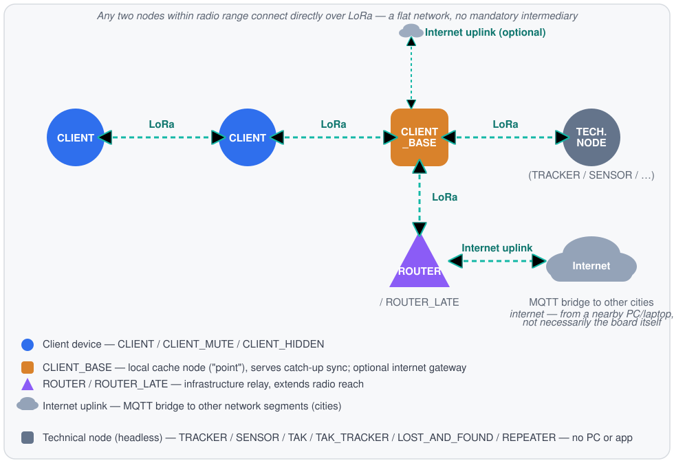
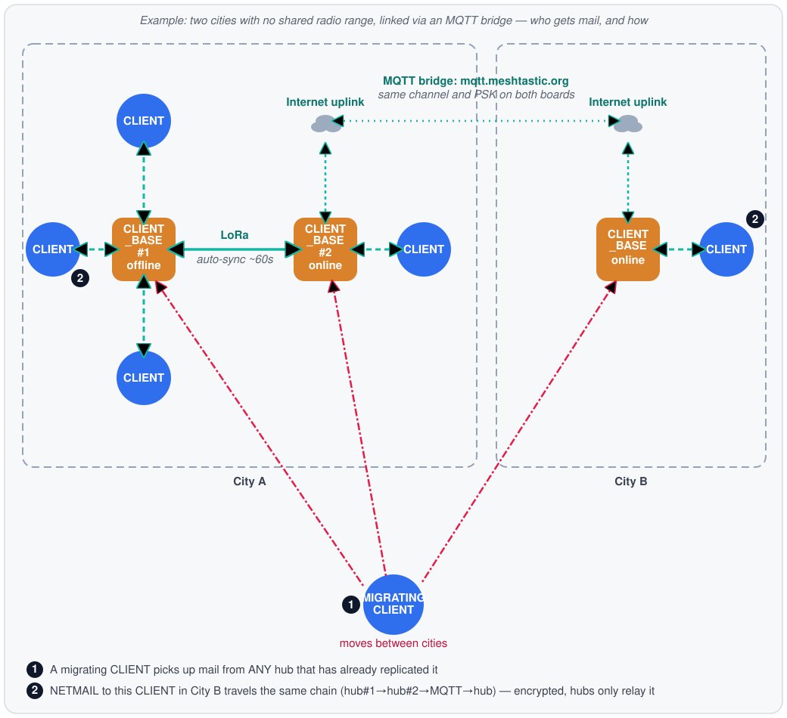
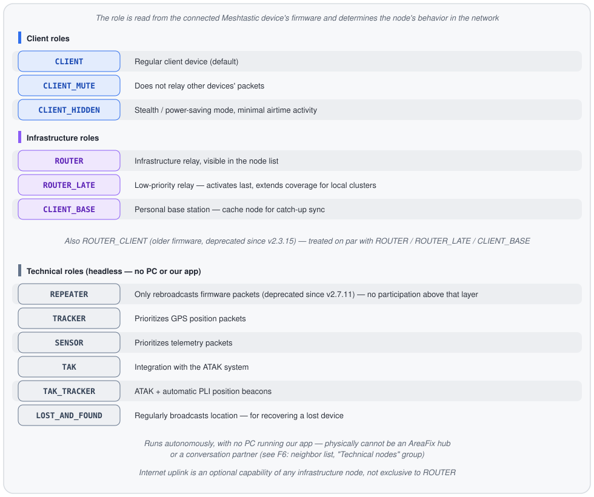
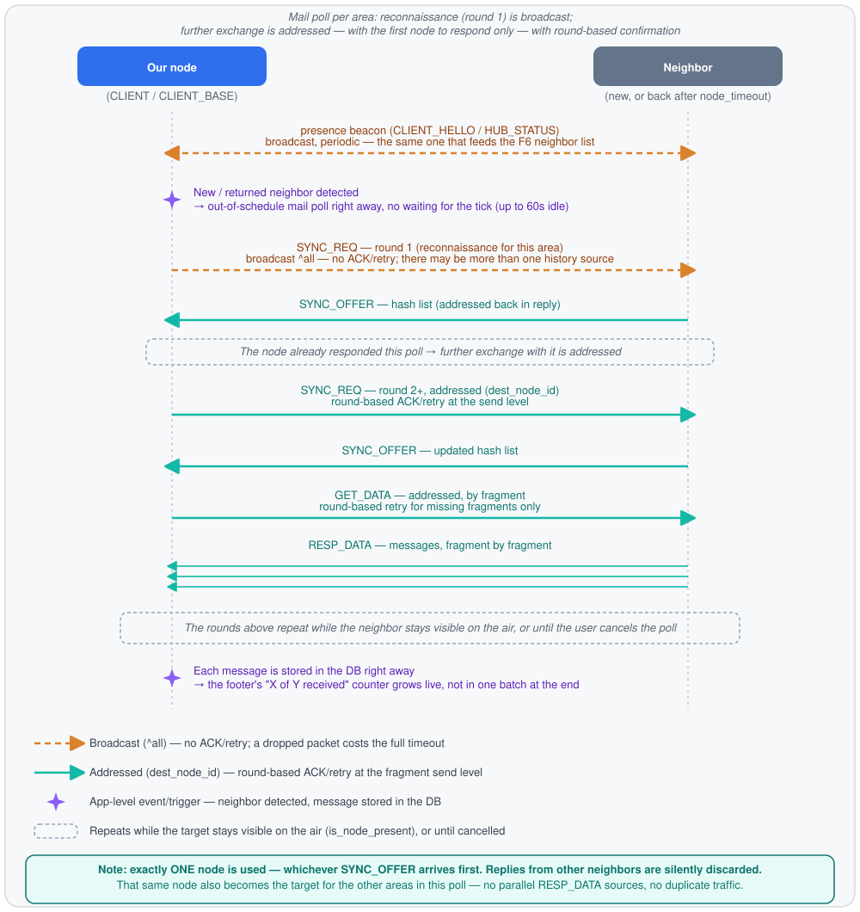
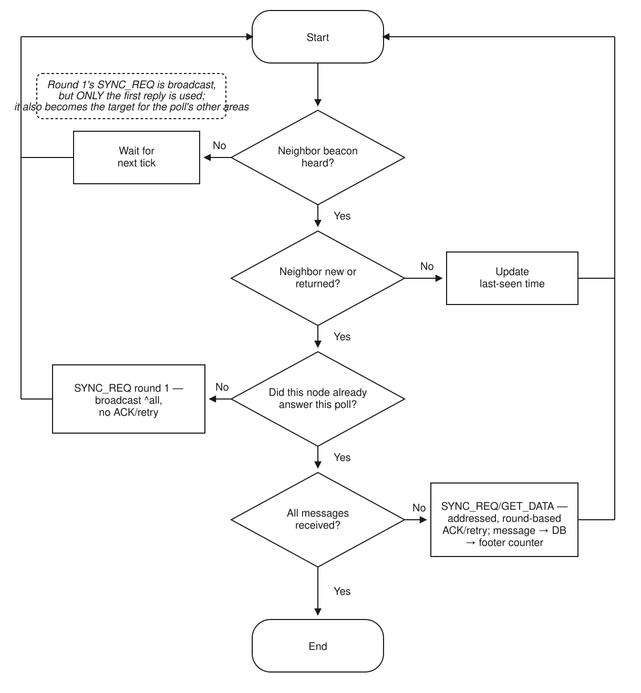

# Meshtastic-FIDO: Technology

Meshtastic-FIDO is an offline echo-conference and personal mail (netmail)
network in the spirit of classic FidoNet / the GoldED editor, built on top of
the **Meshtastic (LoRa)** physical radio protocol. The network requires
neither internet nor a provider: every node stores messages locally, and they
propagate over the airwaves between nodes.

> The low-level binary frame packing and fragmentation protocol
> (`PackerEngine`) is our own development and a proprietary part of the
> technology. This document describes it only at the level of purpose and
> role within the system — without frame format details, opcodes, or the
> chunking algorithm.

---

## 1. Client Types

Several logically distinct node types take part in the network. Physically
it's the same TUI application — the difference between types is defined by
the **device role** (see section 2) and whether the node runs a background
service that shares history with neighbors.

Any two nodes within radio range connect over LoRa directly — the network
is flat, with no hierarchy and no single mandatory intermediary. CLIENT_BASE
and ROUTER are called out separately not because traffic must pass through
them, but because they additionally carry a service load: CLIENT_BASE holds
a history cache for catch-up, ROUTER performs priority relaying that extends
network reach (including to nodes outside direct range — via a chain of
intermediate relays).

### Regular client (network operator)
The standard participant: reads and writes echomail and netmail through the
TUI, subscribes to echo areas, and replies to messages. Runs on a "client"
device role (`CLIENT`, `CLIENT_MUTE`, `CLIENT_HIDDEN` — see section 2). Keeps
its own mail and subscription list in its own local database. Connects over
LoRa directly to any other node within radio range — to another regular
client exactly the same way as to a `CLIENT_BASE` or `ROUTER`.

### Technical nodes — no PC, no app (`REPEATER`, `TRACKER`, `SENSOR`, `TAK`, `TAK_TRACKER`, `LOST_AND_FOUND`)
These roles are headless: the device runs autonomously (often on battery or
solar power), with no PC permanently attached, and physically cannot run our
app. Such a node can never be a conversation partner or an AreaFix hub — it
only relays or collects data at the Meshtastic firmware level (packet
rebroadcast, GPS/telemetry, ATAK integration). In the neighbor list
(**F6**), these nodes are visually separated from network participants into
their own grey "Technical nodes" group.

### Local cache node / "point" (`CLIENT_BASE`)
The same TUI application, but on a device with the **`CLIENT_BASE`** role
that stays physically powered on for extended periods. Such nodes run a
background service that shares echo-area history and serve catch-up of missed
messages to neighboring clients that return to the air. This is the closest
analogue of a "point" in FidoNet terminology. Internet access is optional
for such a node, not required — see below.

Beyond sharing its own subscriptions with neighbors, a `CLIENT_BASE` also
actively mirrors the FULL catalog of any other `CLIENT_BASE` it meets — not
just the areas it happens to be subscribed to itself. Before its usual
subscription sweep, such a node asks a neighboring infrastructure node for
its full area list and adopts whatever it didn't already know about locally
— those areas then replicate through the same two-way mechanism as regular
subscriptions. A plain `CLIENT` doesn't do this — it still only catches up
on history for areas it's actually subscribed to, same as before.

### Infrastructure relay node (`ROUTER` / `ROUTER_LATE`)
Extends the network's radio range by relaying packets further, including to
nodes outside direct range.

### Internet uplink — an optional capability of any infrastructure node
Internet access isn't tied to a specific role: both `ROUTER`/`ROUTER_LATE`
and `CLIENT_BASE` can additionally have internet access, on equal footing
with a relay node. Lacking internet doesn't prevent a node from doing its
main job (history sharing for `CLIENT_BASE`, relaying for `ROUTER`).

Bridging disjoint network segments (for example, between cities with no
shared radio range) is a separate capability built on top of the internet
uplink, via Meshtastic firmware's built-in MQTT client proxy: the node
delegates the actual broker connection to this application (the board
itself usually has no WiFi/IP of its own), while the board publishes/
receives over-the-air packets through the same serial channel. The bridge
operates strictly below the echo-area protocol — the frame format and
fragmentation don't change at all, packets are simply also relayed through
the broker instead of (or alongside) the radio link. Both sides need
matching broker settings and channel key — configured on the board itself
(official Meshtastic app/CLI), not by this application.
By default this uses the shared public broker `mqtt.meshtastic.org`; if it's
congested with unrelated traffic (it's shared by the whole Meshtastic network,
not just Meshtastic-FIDO), a less congested project broker is available instead
— connection details in `helpme.md`, section 9. Both bridge sides need to match
on the same broker for a direct MQTT exchange, but a mismatched choice doesn't
split the network as a whole — nodes still find each other via DHT/Relay (see
below).

**Practical consequence (confirmed on real hardware, 2026-08-06):** the
actual TCP connection to the broker is held by THIS APPLICATION — i.e. the
device it's running on (laptop, PC), not the LoRa board itself: most boards
have no internet-capable WiFi module of their own at all. This means getting
fresh messages through the bridge only requires ANY internet-connected
computer near the board (over USB/BLE/local network) — even a phone in
mobile-hotspot mode. The board's own WiFi state is irrelevant here; in fact,
on ESP32 boards enabling network on the board itself disables Bluetooth at
the firmware level (confirmed via official Meshtastic documentation, see
helpme.md), so for this scenario it's actually sensible to keep the board's
own network off and carry the internet connection separately — for example,
by connecting to the board over BLE.
**Important:** the board's BLE holds exactly one connection at a time — if the
board is already connected over BLE to a phone (e.g. the official Meshtastic
app has an open BLE session), this application won't find or connect to it
over BLE until the phone disconnects (see helpme.md, section 3/7).
**Important about PIN pairing:** if the board's `Bluetooth → pairing mode` is
`RANDOM_PIN`/`FIXED_PIN` (not `NO_PIN`), PIN pairing must be done through the
operating system itself (Windows/macOS/Linux Bluetooth settings) BEFORE
connecting from this application — it has no PIN entry field of its own
(see helpme.md, section 3).

**A migrating CLIENT and cross-city replication (confirmed, 2026-08-06):** if
CLIENT_BASE nodes in different cities had internet and brought the bridge up
(see above), two-way anti-entropy replication has already happened between
them — so a CLIENT that later comes within radio range of EITHER of those
nodes IN A DIFFERENT CITY will pick up whatever already replicated, even if
THAT SPECIFIC node has no internet at the moment of the encounter.
What matters isn't whether the encountered node has internet RIGHT NOW, but
whether it had a chance to sync beforehand: internet at the moment of the
encounter is a strong freshness signal (it means the node could have just
updated), but it isn't the only way to get current mail — a node that
replicated earlier and is now temporarily offline can serve it just as well.

**Conditions under which the chain above actually works (important caveats,
2026-08-06):**

- **The application must be running on every intermediate hub.** All of this
  logic (`AreaFixServer`, `MqttBridge`, periodic polling) lives in the TUI
  application itself, not in the board's firmware — a powered-off or
  not-running hub relays nothing, regardless of what role it's configured
  with.
- **Delivery isn't instant.** It travels hop by hop: client → nearest hub →
  that hub's neighbor on the local mesh → bridge → the hub in the other city
  → its client — and each hop runs on its own polling cycle (periodic, every
  ~60 seconds, or immediate when someone manually opens the echo/NETMAIL
  screen). Several hops typically means minutes, not seconds.
- **NETMAIL (personal mail) replicates through the SAME mechanism as a
  regular echo area** — full replication between nodes exchanging history,
  not address-based routing to the recipient. Hubs along the path store and
  relay personal messages just like everything else, including ones not
  addressed to them — confidentiality comes from end-to-end encryption (the
  recipient decrypts with their own key), not from the message "passing by"
  nodes it isn't meant for.
- **But the exchange between a hub and a regular client polling for mail is
  addressed, not full.** When a regular `CLIENT` asks a nearby node "is there
  new mail", it only receives NETMAIL messages addressed to itself — not the
  whole personal-mail cache the hub keeps for full hub-to-hub replication
  (see the point above). Metadata for other people's mail (subject, sender,
  date) — not just the encrypted body — isn't sent to such a client at all.
- **Both bridge-side CLIENT_BASE nodes must be configured with the same
  channel/PSK and the same broker** (`mqtt.meshtastic.org` or the project's
  own, see above) — without this, the two cities simply can't hear each
  other through the bridge, regardless of everything else (but they'll still
  find each other via DHT/Relay below — slower than a direct bridge, but
  without this manual setup).

### Fallback path for nodes without a shared MQTT channel — DHT discovery and relay
The MQTT bridge above needs manual upfront setup — both CLIENT_BASE nodes have
to already agree on the same channel/PSK. For nodes without that prior
arrangement (or that haven't made one yet), the app can find each other and
exchange mail a different way, entirely independent of the board's firmware
and its MQTT proxy — through the plain internet connection of the computer
the app itself runs on.

Discovery is built on top of an already-existing, decades-old public network
(the same technology torrent clients use to find swarms without a central
server) — nodes find each other by a shared network identifier, without
publishing anything about the content of the correspondence: the DHT is used
purely as a directory of "who else is on the network and what address to
look for them at" — mail exchange itself still goes directly between nodes
over the app's own protocol, same as always.

Once two nodes find each other, they try to connect directly over TCP/IP. If
that fails — a common situation when both nodes sit behind a home router or a
mobile carrier without an external IP address (NAT/CGNAT) — a helper relay
server is used instead: both nodes connect to it with an outbound connection
(which works almost everywhere, even where inbound connections are blocked),
and it simply forwards the same encrypted/signed packets between them,
without any more access to their content than any intermediate node on a
message's path over the radio would have.

**An active VPN on the computer/router interferes with this direct path
specifically** — the app determines its own externally-visible address to
find itself in DHT results and avoid dialing itself; with a VPN active, that
address ends up being the VPN server's, not the one the node actually
listens on, and the direct connection may fail or be slower. It's best to
turn VPN off for the duration of field tests of this path; radio and the
MQTT bridge aren't affected by it.

This path doesn't replace the MQTT bridge (that one serves a different
purpose — routine exchange between cities that have already arranged to work
together) and needs no manual setup from a regular user — given internet
access, it works automatically in the background, as an extra way to find
correspondents beyond direct radio range.

### Local-network discovery — no internet needed at all
Separate from the DHT/relay path above (both need an internet connection),
the app can also find neighbors within a single local network — for example,
in an office or institution where several nodes share a common wired or
Wi-Fi network. This discovery needs no internet at all and doesn't depend on
DHT: nodes simply announce themselves with a broadcast within the local
network and find each other right away. If that same local network has a
node with internet access, it naturally becomes a bridge — syncing with both
its local neighbors and the wider world via DHT/relay, and carrying mail
between the two the same two-way way it does everywhere else in the network.

---

## 2. Client Roles (Meshtastic `Config.DeviceConfig.Role`)

The role is read from the firmware of the connected Meshtastic device and
determines the node's behavior in the network:

### How the role affects network behavior
- Every node — client or infrastructure — independently stores its own mail
  and subscription list in its own local database. Subscribing to an echo
  area is the client's own decision, not a permission that has to be asked
  of anyone.
- Infrastructure nodes (`ROUTER`, `ROUTER_LATE`, `CLIENT_BASE`) additionally
  hold echo-area history and serve catch-up of missed messages to neighbors
  returning to the air. This service runs independently on each
  infrastructure node: a client isn't tied to one specific node — if one is
  unavailable, history can be caught up from any other one in range.
- The `[H]`/`[C]` indicator in the interface reflects whether the current
  node is acting as infrastructure or as a regular client; the visible
  neighbor counters show how many nodes of each type are nearby.
- The client obtains the list of available echo areas from any available
  infrastructure node — not necessarily always the same one.

---

## 3. Data Delivery (general outline)

> **Short version:** a neighbor appearing on the air triggers a broadcast
> "who has mail for this area" question (round 1) — this is reconnaissance,
> not a greeting aimed at one specific node, and more than one neighbor can
> answer. But only the **first** reply that arrives is used — the rest are
> silently discarded, and every further exchange (rounds 2+, including for
> other areas in the same poll) is addressed to that one node. That's what
> keeps several CLIENT_BASE nodes from all sending the same history at once.

Messages (echomail, netmail, control commands) pass through a single packing
and fragmentation pipeline (`PackerEngine`) before going out over the air,
which brings them within the LoRa radio channel's MTU limits and reassembles
them on receipt — the same path for every message, with no special cases.

The network is decentralized at the delivery level: live messages propagate
by broadcast relaying over the air, with no dependency on one specific node.
Catch-up of missed history is bidirectional as well: when two nodes meet over
the air (for example, a client that spent time without a reachable
infrastructure node meets one, or meets another client), they exchange
whatever messages the other one is missing in both directions — not just
"the client pulls from the hub." Either side can serve the catch-up; it isn't
tied to a single fixed node.

A new or newly-returned neighbor appearing on the air (via the same presence
beacon that feeds the neighbor list on **F6**) immediately triggers an
out-of-schedule mail poll, instead of waiting for the next periodic cycle (up
to a minute of pointless idling). That beacon isn't a one-time "introduction"
aimed at a specific node — it's a continuous background signal both nodes
keep sending each other periodically while on the air; detecting a
new/returned neighbor is simply a trigger fired when such a beacon arrives.

The very first sync request for each area (the reconnaissance round, before
any confirmed contact) deliberately stays broadcast ("^all") — there may be
more than one source of history, and different infrastructure nodes can have
different replication levels, so there's no point asking only one
pre-selected neighbor. More than one neighbor can answer that broadcast
question — but only the **first** reply to arrive is used: any other
SYNC_OFFERs, even if they do get through, are simply discarded unprocessed.
Any further exchange within this poll — rounds 2+, `GET_DATA`, `RESP_DATA` —
is addressed to that one node only, never to several in parallel. On real
radio this rule extends beyond a single area, too: as soon as any neighbor
answers, it becomes the reconnaissance target for the rest of the subscribed
areas in the same poll as well, instead of paying a full broadcast timeout
for each area separately.

That addressed reconnaissance for the remaining subscriptions is itself
batched into a single request rather than one round-trip per area: the list
of areas goes out in one `SYNC_REQ` and comes back in one `SYNC_OFFER`
carrying an offer for each of them. The number of reconnaissance round-trips
stops growing linearly with the number of subscriptions — five subscribed
areas mean one combined request-response, not five sequential radio
round-trips in a row. Only the reconnaissance itself ("who has what") is
batched this way; the follow-up addressed catch-up per area for missing
messages (`GET_DATA`/`RESP_DATA`) stays separate for each area, same as
before.

This is a deliberate design choice, not a side effect: heavy traffic
(`RESP_DATA`, message fragments) physically comes from one source at a time,
so several CLIENT_BASE nodes holding the same history for an area can't end
up simultaneously sending the same new messages and doubling airtime traffic.
As a backstop against duplication anyway (say, a message arrives via catch-up
in one round while also being pushed by a neighbor through a different
replication path at the same time), storage by `msg_id` ignores repeats
(`INSERT OR IGNORE`), so a duplicate simply won't be stored twice even if it
did get through.

Beyond packing and fragmentation themselves, the same pipeline also saves
airtime and stays resilient under channel congestion: protocol-aware
compression, send ordering under airtime congestion, protection against the
same packet being relayed in an endless loop, and compact representations
for large history lists. Like the frame format, the details of these
mechanisms remain part of `PackerEngine`'s closed implementation and aren't
disclosed here.

For addressed (non-broadcast) multi-fragment sends, fragments left
unacknowledged after a confirmation round are selectively resent — only the
missing pieces, not the whole message — for as long as the recipient stays
visible on the air, or until the user manually cancels the mail poll. See
`helpme.md`, section 13, for details.

Through the same beacon nodes use to announce themselves on the network, each
node shares its version number with neighbors — the app's own version and,
separately, the `PackerEngine` protocol version (see the box above — the two
change independently). If a neighbor turns out to be running a newer version,
the user sees a warning in the interface; updating a node remains a user
action either way — the app never downloads or installs anything on its own.

---

## 4. Message Authenticity and Privacy

Every message is signed on the sending node with the app's own key pair (not
the radio module's hardware key), generated locally on first launch. Any
receiving node — including infrastructure nodes that relay and cache
history — independently re-verifies the signature rather than trusting
someone else's verification flag. If the signature doesn't check out, the
message isn't silently dropped; it's marked `[UNVERIFIED]` in the interface,
so the reader can see the sender's authenticity hasn't been confirmed.

Personal mail (netmail with a known recipient) is additionally encrypted
with a separate key pair, independent from the signing key — following
common practice (the same principle used by PGP/SSH/Signal: a signing key
and an encryption key are never reused for each other). One consequence:
an infrastructure node that caches and relays someone else's personal mail
is physically unable to read its body — it simply doesn't hold the actual
recipient's private key.

Nodes exchange encryption keys using TOFU (trust-on-first-use, as in
SSH/PGP): the sender's public encryption key rides along with every signed
message, and the receiving side remembers it the first time it's seen. On a
later mismatch, the key is not silently overwritten — the same fundamental
trade-off any TOFU scheme makes (the impersonation risk exists only at the
very first encounter between two nodes).
