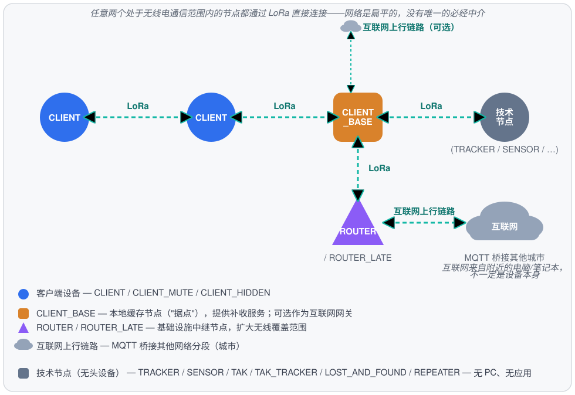
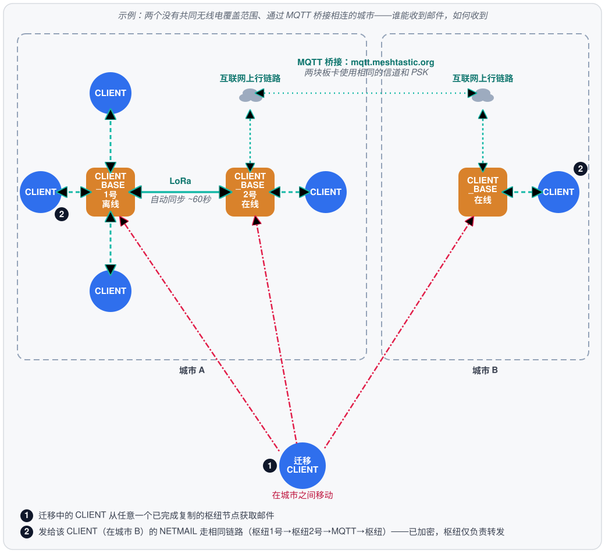
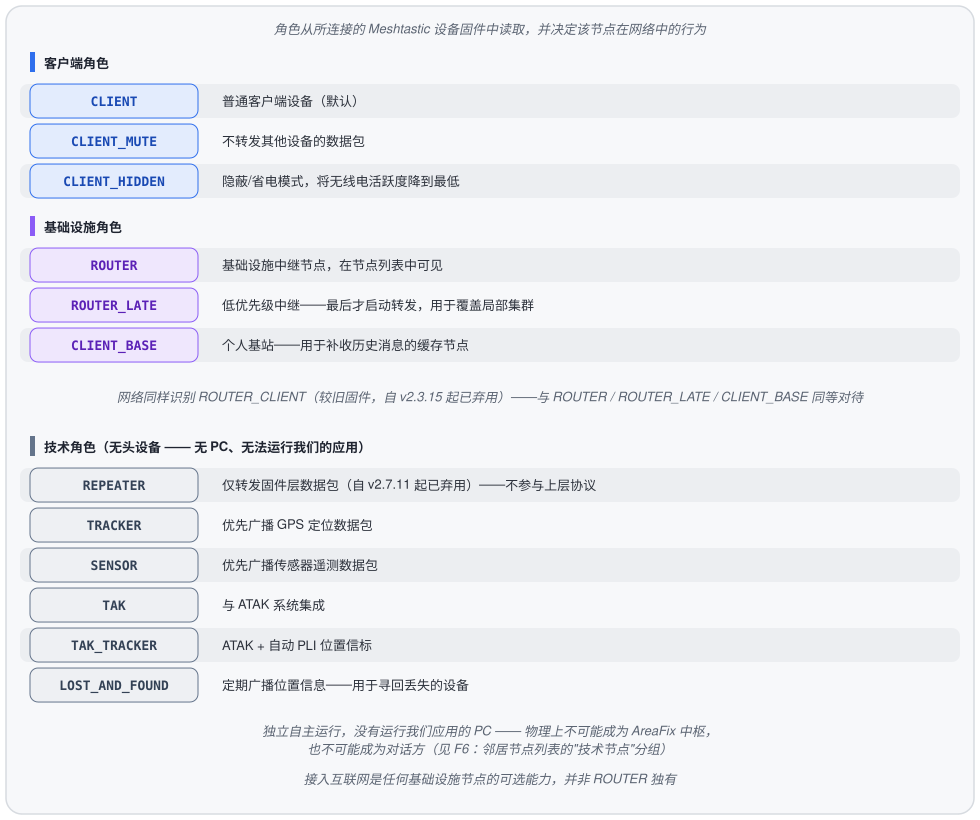
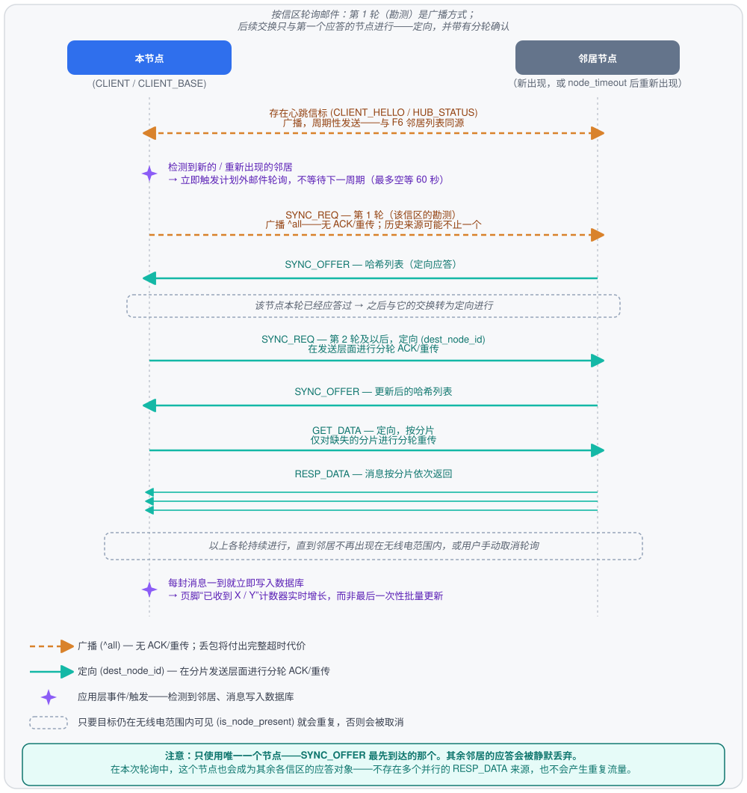
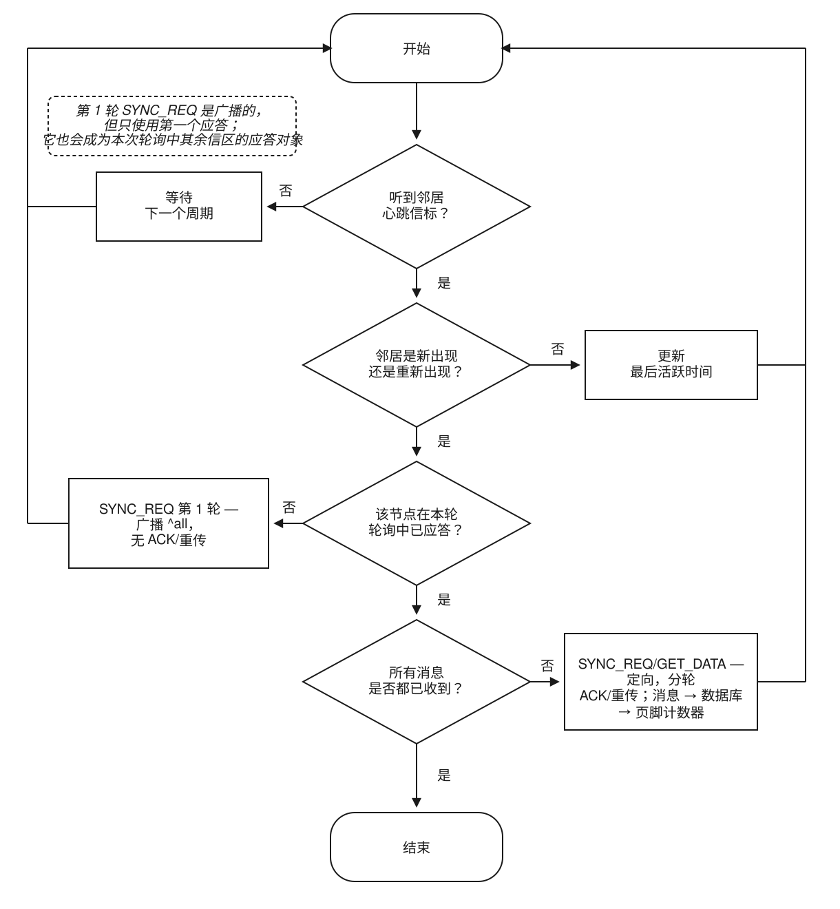

# Meshtastic-FIDO：技术说明

Meshtastic-FIDO 是一个基于经典 FidoNet / GoldED 编辑器理念、构建在
**Meshtastic (LoRa)** 物理无线协议之上的离线信区（echo-conference）与私人
邮件（netmail）网络。该网络不需要互联网或运营商：每个节点在本地保存消息，
消息通过无线电波在节点之间传播。

> 底层的二进制帧打包与分片协议（`PackerEngine`）是我们自主研发、且属于
> 本技术专有（proprietary）的部分。本文档仅在用途和系统角色层面进行描述，
> 不涉及帧格式、操作码或分片算法的细节。

---

## 1. 客户端类型

网络中存在若干逻辑上不同的节点类型。物理上它们是同一个 TUI 应用程序——
类型之间的区别由**设备角色**决定（见第 2 节），以及该节点是否运行向邻近
节点分发历史消息的后台服务。

任意两个处于无线电通信范围内的节点都通过 LoRa 直接连接——网络是扁平的，
没有层级结构，也没有唯一的必经中介。图中之所以单独标出 CLIENT_BASE 和
ROUTER，并非因为流量必须经过它们，而是因为它们额外承担了服务职能：
CLIENT_BASE 保存历史消息缓存供补收使用，ROUTER 执行优先中继，扩大网络
覆盖范围（包括通过一连串中继节点到达直接无法触及的节点）。

### 普通客户端（网络用户）
标准参与者：通过 TUI 阅读和撰写信区邮件与 netmail，订阅信区并回复消息。
运行在"客户端类"设备角色上（`CLIENT`、`CLIENT_MUTE`、`CLIENT_HIDDEN`——见
第 2 节）。在自己的本地数据库中保存自己的信件和订阅列表。通过 LoRa 与通信
范围内的任何其他节点直接连接——与另一个普通客户端连接的方式，同与
`CLIENT_BASE` 或 `ROUTER` 连接完全一样。

### 技术节点 —— 没有 PC、无法运行我们的应用（`REPEATER`、`TRACKER`、`SENSOR`、`TAK`、`TAK_TRACKER`、`LOST_AND_FOUND`）
这些角色是无头（headless）设备：设备自主运行（常用电池或太阳能供电），
没有长期连接的 PC，物理上无法运行我们的应用。这类节点永远不可能成为对话方
或 AreaFix 中枢——它只在 Meshtastic 固件层面转发或采集数据（数据包转发、
GPS/遥测、ATAK 集成）。在邻居节点列表中（**F6**），这些节点会与网络参与者
视觉上分开，单独归入灰色的"技术节点"分组。

### 本地缓存节点 /「据点」(`CLIENT_BASE`)
同一个 TUI 应用程序，但运行在角色为 **`CLIENT_BASE`** 的设备上，该设备
长时间保持物理开机状态。这类节点运行后台服务，分发信区历史消息，并为
重新上线的邻近客户端提供缺失消息的补收。这是 FidoNet 术语中「据点」
（point）概念最接近的对应物。该节点是否接入互联网是可选的，并非必须——
见下文。

除了向邻居分发自己订阅的内容之外，`CLIENT_BASE` 还会主动镜像所遇到的
其他 `CLIENT_BASE` 的**完整目录**——不仅限于自己已订阅的信区。在照常
遍历订阅列表之前，这类节点会向邻近的基础设施节点索取其完整信区列表，
并将本地尚不知道的信区收录进来——此后它们通过与普通订阅相同的双向机制
持续复制。普通 `CLIENT` 不会这样做——它仍然只补收自己实际订阅的信区的
历史消息，与之前一样。

### 基础设施中继节点 (`ROUTER` / `ROUTER_LATE`)
通过继续中继数据包来扩大网络的无线覆盖范围，包括到达直接无法触及的节点。

### 互联网上行链路——任何基础设施节点的可选能力
接入互联网并不绑定于特定角色：无论是 `ROUTER`/`ROUTER_LATE` 还是
`CLIENT_BASE`，都可以额外接入互联网，与中继节点地位相同。没有互联网并不
妨碍节点履行其主要职责（`CLIENT_BASE` 的历史分发、`ROUTER` 的中继）。

在互联网上行链路基础上，还有一项独立能力：连接不同网络分段（例如，两个
没有共同无线电覆盖范围的城市）——通过 Meshtastic 固件内置的 MQTT 客户端
代理（MQTT client proxy）实现：节点把与 MQTT 代理服务器的实际连接委托给
本应用程序（板卡本身通常没有自己的 WiFi/IP），板卡则通过同一个串口通道
发布/接收空口数据包。该桥接机制严格运行在信区协议之下——帧格式和分片逻辑
完全不变，数据包只是额外通过代理服务器转发（而非仅通过无线电，或与之并
存）。两端需要配置相同的代理服务器地址和信道密钥——在板卡本身上配置（通过
官方 Meshtastic 应用程序/CLI），而非本应用程序。
默认使用公共共享代理 `mqtt.meshtastic.org`；如果它被无关流量拥堵（它是整个
Meshtastic 网络共用的，不仅限于 Meshtastic-FIDO），也可以改用负载较低的项目
自建代理——连接信息见 `helpme.md` 第 9 节。桥接双方要直接通过 MQTT 交换，
需要使用同一个代理，但双方代理不一致并不会分裂整个网络——节点仍可通过下文的
DHT/Relay 找到彼此。

**实际意义（已在真实硬件上验证，2026-08-06）：** 与代理服务器的真实 TCP
连接由本应用程序所在的设备（笔记本电脑、台式机）持有，而不是 LoRa 板卡
本身——大多数板卡根本没有能连接互联网的 WiFi 模块。这意味着，只要在板卡
附近（通过 USB/BLE/局域网）有任意一台能上网的电脑——哪怕是开着热点模式的
手机——就能通过该桥接收到最新消息。板卡自身的 WiFi 状态与此无关；而且在
ESP32 板卡上，板卡本身开启网络会在固件层面关闭蓝牙（已通过 Meshtastic
官方文档确认，见 helpme.md），所以在这个场景下，让板卡的网络保持关闭、
另外自带一个联网设备，反而是更合理的做法——例如改用 BLE 连接板卡。
**重要提示：** 板卡的 BLE 同时只能保持一个连接——如果板卡此时已经通过
BLE 连接到手机（例如手机上打开着官方 Meshtastic 应用并保持 BLE 会话），
本应用将无法通过 BLE 找到或连接该板卡，直到手机断开连接为止（参见
helpme.md 第 3/7 节）。
**关于 PIN 配对的重要提示：** 如果板卡的 `Bluetooth → 配对模式` 设置为
`RANDOM_PIN`/`FIXED_PIN`（而非 `NO_PIN`），PIN 配对必须在操作系统层面完成
（Windows/macOS/Linux 的蓝牙设置），且要在本应用连接之前完成——本应用本身
没有自己的 PIN 输入界面（参见 helpme.md 第 3 节）。

**迁移中的 CLIENT 与跨城市复制（已确认，2026-08-06）：** 如果不同城市的
CLIENT_BASE 都曾接入互联网并建立了桥接（见上文），它们之间就已经完成了
双向反熵（anti-entropy）复制——此后，只要 CLIENT 通过无线电靠近位于另一
座城市的这些节点中的任意一个，就能获取已经复制过去的内容，即使这个具体
节点在相遇的那一刻并未联网。真正重要的不是所遇到的节点此刻是否联网，而是它此前是否有机会
提前完成同步：相遇时联网是新鲜度的有力信号（说明该节点可能刚刚更新过），但
并非获取最新邮件的唯一条件——一个提前完成复制、当前暂时离线的节点同样能够
提供最新邮件。

**上述链路真正生效所需的条件（重要说明，2026-08-06）：**

- **每个中间枢纽都必须运行本应用程序。** 上述全部逻辑（`AreaFixServer`、
  `MqttBridge`、周期性轮询）都运行在 TUI 应用程序本身，而非板卡固件中——
  未开机或未运行应用程序的枢纽不会转发任何内容，无论其角色配置为何。
- **投递不是即时的。** 消息按跳数传递：客户端 → 最近的枢纽 → 该枢纽在本地
  网络中的邻居 → 桥接 → 另一城市的枢纽 → 其客户端——每一跳都按自己的轮询
  周期运行（周期性，约每 60 秒一次，或在有人手动打开信区/NETMAIL 界面时
  立即触发）。经过多跳通常意味着几分钟，而不是几秒钟。
- **NETMAIL（私人邮件）通过与普通信区完全相同的机制复制**——在交换历史
  记录的节点之间进行完整复制，而非按地址路由到收件人。路径上的枢纽会
  存储并转发所有私人消息，包括并非发给自己的——机密性由端到端加密保证
  （收件人用自己的密钥解密），而不是靠消息"绕过"与其无关的节点。
- **但枢纽与普通客户端之间的邮件轮询交换是按地址进行的，并非完整复制。**
  当普通 `CLIENT` 向邻近节点询问"是否有新邮件"时，就 NETMAIL 而言，它只会
  收到寄给自己的邮件——而不是枢纽为了枢纽间完整复制而保存的整个私人邮件
  缓存（见上一条）。其他人邮件的元数据（主题、发件人、日期）——不仅仅是
  加密的正文——完全不会发送给这样的客户端。
- **桥接两端的 CLIENT_BASE 必须配置相同的信道/PSK，并使用同一个代理**
  （`mqtt.meshtastic.org` 或项目自建代理，见上文）——不满足这一条件，两个
  城市根本无法通过桥接互相听到对方（但仍可通过下文的 DHT/Relay 找到彼此
  ——比直接桥接慢，但不需要这项手动配置）。

### 没有共同 MQTT 信道时的备用路径——DHT 发现与中继
上面的 MQTT 桥接需要事先手动配置——两端的 CLIENT_BASE 必须提前约定好同一个
信道/PSK。对于没有这种事先约定（或者还没来得及约定）的节点，本应用还有另一
条完全独立于设备固件及其 MQTT 代理的途径来互相发现并交换邮件——
直接使用运行本应用的电脑自身的互联网连接。

节点发现建立在一个已经存在、运行了数十年的公共网络之上（与 BT 客户端在没有
中心服务器的情况下寻找种群所用的技术相同）——节点通过共同的网络标识符找到
彼此，过程中不会公开任何关于通信内容的信息：DHT 仅仅被当作一个"网络里还有谁、
到哪个地址能找到它"的目录来使用，邮件本身的交换仍然像以往一样，直接在节点之间
按本应用自身的协议进行。

两个节点互相找到后，会先尝试通过 TCP/IP 直接连接。如果失败——比较常见的情况
是双方都处于家用路由器或没有外部 IP 地址的移动运营商网络之后（NAT/CGNAT）——
就会改用一个辅助中继服务器：两个节点都以出站连接方式连上它（这种方式几乎在任
何环境下都可用，即便入站连接被屏蔽），中继只是在它们之间转发同样经过加密/签名
的数据包，对内容的可见程度并不比邮件在无线电路径上经过的任何中间节点更多。

**电脑/路由器上开启的 VPN 恰恰会干扰这条直连路径**——本应用会确定自己对外可见
的地址，用来在 DHT 结果中识别出自己、避免拨打自己；如果此时 VPN 处于开启状态，
确定出的地址会是 VPN 服务器的地址，而不是节点实际监听的地址，直连可能因此失败
或变慢。测试这条路径时，建议暂时关闭 VPN；无线电和 MQTT 桥接不受此影响。

这条路径并不会取代 MQTT 桥接（后者服务于另一个目的——已经事先约定好合作的
城市之间的日常交换），普通用户也无需任何手动配置——只要有互联网连接，它就会
在后台自动工作，作为在直接无线电覆盖范围之外寻找通信对象的额外手段。

### 局域网内发现——完全不需要互联网
与上文的 DHT/中继路径不同（两者都需要互联网连接），本应用还能在同一个局域网
内发现邻居节点——例如在一个办公室或机构里，若干节点共用同一个有线或 Wi-Fi
网络。这种发现方式完全不需要互联网，也不依赖 DHT：节点只需在局域网内广播
自身即可立即互相发现。如果同一局域网中恰好有一个节点具备互联网访问，它会
自然地成为桥梁——既与局域网内的邻居同步，也通过 DHT/中继与外部世界同步，
并用网络中其他地方相同的双向机制在两者之间传递邮件。

---

## 2. 客户端角色（Meshtastic `Config.DeviceConfig.Role`）

角色从所连接的 Meshtastic 设备固件中读取，并决定该节点在网络中的行为：

### 角色如何影响网络行为
- 每个节点——无论客户端类还是基础设施类——都独立地在自己的本地数据库中
  保存自己的信件和订阅列表。订阅某个信区是客户端自己的决定，而不是需要
  向他人请求的许可。
- 基础设施节点（`ROUTER`、`ROUTER_LATE`、`CLIENT_BASE`）额外保存信区历史
  消息，并为重新上线的邻近节点提供缺失消息的补收服务。该服务在每个基础
  设施节点上独立运行：客户端并不绑定于某一个特定节点——如果其中一个不可
  用，仍可从通信范围内的任何其他节点补收历史。
- 界面中的 `[H]`/`[C]` 指示符反映当前节点表现为基础设施节点还是普通客户
  端；可见邻居计数器显示周围各类型节点的数量。
- 客户端从任意可用的基础设施节点获取可用信区列表——不一定总是同一个。

---

## 3. 数据传输（总体概述）

> **简述：** 邻居出现在空口上，会触发一次广播式的「这个信区谁有邮件」提问
> （第 1 轮）——这是勘测，而不是针对某一个特定节点的问候，应答的邻居也可能
> 不止一个。但只会使用**最先**到达的那个应答——其余的会被静默丢弃，之后的
> 全部交换（第 2 轮及以后，包括本次轮询中的其他信区）都只对这一个节点定向
> 进行。这正是为了避免多个 CLIENT_BASE 同时发送同一份历史数据。

消息（信区邮件、netmail、控制指令）在发往空口之前，都会经过统一的打包与
分片流水线（`PackerEngine`）——将其限制在 LoRa 无线信道的 MTU 范围内，
并在接收端重新组装——所有消息都走同一条路径，没有特殊分支。

该网络在投递层面是去中心化的：实时消息通过空口广播中继传播，不依赖于
任何一个特定节点。缺失历史消息的补收同样是双向的：当两个节点在空口相遇
时（例如，一个客户端在一段时间内没有可用的基础设施节点，之后遇到了这样
的节点，或遇到了另一个客户端），双方会把对方缺失的消息双向补齐给对方——
而不仅仅是「客户端向据点单向拉取」。补收服务可以由任意一方提供，并不绑定
于某个固定节点。

当一个新的、或重新回到无线电范围内的邻居出现时（通过与 **F6** 邻居列表
同源的存在心跳信标），会立即触发一次计划外的邮件轮询，而不是等待下一个
周期性轮询——避免无谓地空等最多一分钟。这个心跳信标并不是对某个特定节点
的一次性「自我介绍」，而是持续的后台信号——只要双方都在空口，就会周期性
地互相发送；检测到新的/重新出现的邻居，只是收到这样一次信标后触发的事件。

节点正常退出时，会通过同一个信标最后发送一次「离开」标记，让邻居立即
把它从 **F6** 列表中移除，而不是再按静默超时保留几分钟（Meshtastic 没有
「已断开」数据包，因此通常靠静默来判断离开）。如果这次告别信标在空口
丢失，仍会走原来的超时——该节点只是稍晚一点消失。**F6** 中的连接方式
列显示的是最近一次实际收到的本协议帧的承载方式（无线电、MQTT、直连
互联网或中继），而不是主板缓存中可能已过时的记录；页脚的「互联网：✓」
指示灯在任何可用的互联网通路下都会点亮——既包括 MQTT 桥，也包括直连/
DHT（见下文）。

每个信区的第一次同步请求（勘测轮次，尚无已确认的联系人）仍然刻意保持广播
（"^all"）——历史消息的来源可能不止一个，不同基础设施节点的复制程度也
可能不同，所以没有必要只问预先选定的某一个邻居。应答这次广播提问的邻居可能
不止一个，但只会使用**最先**到达的那个应答：其余的 SYNC_OFFER 即使真的
送达了，也会被直接丢弃、不做任何处理。在本次轮询中，后续交换——第 2 轮及
以后、`GET_DATA`、`RESP_DATA`——都只对这一个节点定向进行，绝不会同时对
多个节点并行。在真实无线电上，这条规则甚至扩展到单个信区之外：只要有任意
一个邻居应答过，它就会成为本次轮询中其余已订阅信区的勘测对象，而不必让
每个信区都各自等待一次完整的广播超时。

对其余已订阅信区的这次定向勘测，本身也会被合并成**一次**请求，而不是每个
信区各走一次往返：信区列表通过**一个** `SYNC_REQ` 发出，也通过**一个**
`SYNC_OFFER` 返回，其中包含每个信区各自的应答内容。勘测所需的往返次数不再
随订阅数量线性增长——订阅了五个信区，意味着一次合并的请求-应答，而不是
连续五次独立的无线电往返。被这样合并的只是「谁有什么」这一勘测步骤本身；
后续针对每个信区缺失消息的定向补收（`GET_DATA`/`RESP_DATA`）仍然按信区分别
进行，与之前一样。

这是有意为之的设计，而非副作用：繁重的流量（`RESP_DATA`，邮件分片）在任意
时刻只会来自一个来源，因此持有同一份信区历史的多个 CLIENT_BASE 不会同时
发送同一批新消息、把空口流量翻倍。作为防止重复的兜底手段（比如某封邮件在
一轮补收中到达的同时，又通过另一条复制路径被邻居推送过来），按 `msg_id`
写入数据库时会忽略重复项（`INSERT OR IGNORE`）——即便重复的消息真的到达
了，也不会被存入第二次。

除了打包与分片本身之外，同一条流水线还负责节省空口时间并在信道拥堵时保持
稳健：面向协议特点的压缩、信道拥堵时的发送顺序安排、防止同一数据包被无限
循环转发的保护机制，以及针对大型历史列表的紧凑表示方式。与帧格式一样，这
些机制的具体细节属于 `PackerEngine` 封闭实现的一部分，本文档不作披露。

对于定向（非广播）多分片发送，一轮确认后仍未确认的分片会被选择性地重发——
只补发缺失的部分，而非整条消息重来——只要仍能在空口看到接收方，或直到用户
手动中止邮件轮询为止。详见 `helpme.md` 第13节。

节点通过同一个用于自我宣告的信标，把自己的版本号告诉邻居——包括程序本身
的版本，以及独立于它的 `PackerEngine` 协议版本（见上文说明框——两者各自
独立变化）。如果某个邻居的版本比自己新，用户会在界面中看到相应提示；无论
如何，更新节点始终是用户自己的操作——程序本身不会自动下载或安装任何内容。

---

## 4. 消息的真实性与隐私

每条消息都在发送节点上使用应用自身的密钥对进行签名（并非无线电模块的
硬件密钥），该密钥对在首次启动时于本地生成。任何接收节点——包括负责中继
和历史缓存的基础设施节点——都会独立重新验证签名，而不是信任别处已经做过
的验证结果。如果签名校验不通过，消息不会被静默丢弃，而是在界面中标记为
`[UNVERIFIED]`，提醒读者：发送者的真实性尚未得到确认。

私人邮件（有明确收件人的 netmail）会额外使用另一组独立于签名密钥的密钥
对进行加密——遵循通用实践（与 PGP/SSH/Signal 相同的原则：签名密钥与加密
密钥不会相互复用）。由此带来的结果是：负责缓存和转发他人私人邮件的基础
设施节点，物理上无法读取其正文——因为它根本没有真正收件人的私钥。

节点之间通过 TOFU（首次使用时建立信任，与 SSH/PGP 相同）方式交换加密
密钥：发送者的公钥会随每条已签名的消息一并送达，接收方在第一次见到时
将其记住。此后如遇到不一致，密钥不会被静默覆盖——这是任何 TOFU 方案都
存在的固有取舍（伪装风险只存在于两个节点第一次相遇的那一刻）。

同一个应用密钥不仅为消息签名，也为在线信标签名（即为 **F6** 邻居列表
提供数据的那个信标：「节点在此」、集线器状态、版本号）。该签名在任何
传输方式下都会被校验——无线电、任意 MQTT 代理、直连互联网——因此邻居
的真实性不取决于它使用哪个代理，也不取决于公共代理的负载。信标通过
签名校验的节点会在 **F6** 中标记一个对勾；用与以往不同的密钥签名的信标
会在日志中触发警告（可能存在节点身份伪造），而携带他人 id 的伪造「告别」
信号会被忽略。签名内的时间戳可防止重放先前截获的信标。此外，应用还会
记录每个节点主板的「指纹」（Meshtastic 固件的硬件密钥），并在其变化时
记入日志——重刷、恢复出厂或伪造；该变化会被自动接受，不会阻断网络。
