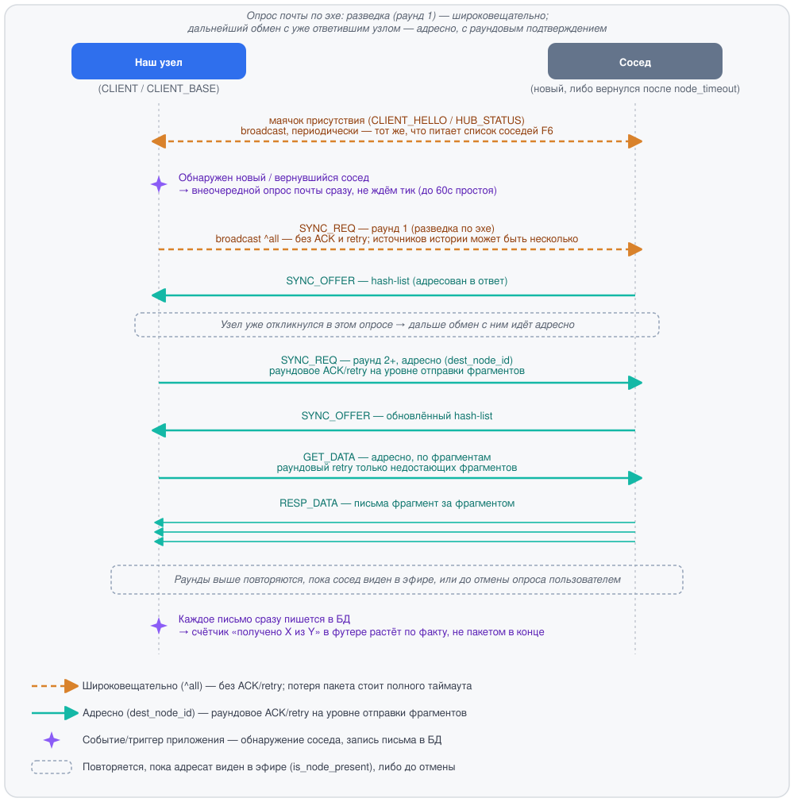

# Meshtastic-FIDO: технология

Meshtastic-FIDO — оффлайн-сеть эхоконференций и личной почты (netmail) в духе
классического FidoNet / редактора GoldED, построенная поверх физического
радиопротокола **Meshtastic (LoRa)**. Сеть не требует интернета и провайдера:
каждый узел хранит сообщения локально, а распространяются они по радиоэфиру
между узлами сети.

> Низкоуровневый бинарный протокол упаковки и фрагментации кадров
> (`PackerEngine`) — собственная разработка и проприетарная часть технологии.
> В этом документе он описан только на уровне назначения и роли в системе,
> без деталей формата кадра, опкодов и алгоритма нарезки.

---

## 1. Типы клиентов

В сети участвует несколько логически разных типов узлов. Физически это одно
и то же TUI-приложение — разница между типами определяется **ролью
устройства** (см. раздел 2) и тем, держит ли узел фоновый сервис раздачи
истории для соседей.

Любые два узла в радиусе слышимости соединяются по LoRa напрямую — сеть плоская,
без иерархии и без единственного обязательного посредника. CLIENT_BASE и ROUTER
выделены на схеме отдельно не потому, что через них обязан идти путь, а потому,
что они дополнительно несут сервисную нагрузку: CLIENT_BASE — кэш истории для
дополучения, ROUTER — приоритетную ретрансляцию, расширяющую охват сети (в т.ч.
до узлов вне прямой досягаемости — через промежуточные ретрансляции по цепочке).

### Обычный клиент (оператор сети)
Стандартный участник: читает и пишет эхопочту и netmail через TUI, подписывается
на эхоконференции и отвечает на сообщения. Работает на «клиентской» роли
устройства (`CLIENT`, `CLIENT_MUTE`, `CLIENT_HIDDEN` — см. раздел 2). Хранит свою
переписку и список подписок в собственной локальной базе. Связывается по LoRa
напрямую с любым другим узлом сети в радиусе слышимости — с таким же обычным
клиентом точно так же, как с `CLIENT_BASE` или `ROUTER`.

### Технические узлы — без нашего приложения (`REPEATER`, `TRACKER`, `SENSOR`, `TAK`, `TAK_TRACKER`, `LOST_AND_FOUND`)
Эти роли headless: устройство работает автономно (часто на батарее или
солнечной панели), без постоянно подключённого ПК, и физически не может
запускать наше приложение. Такой узел никогда не будет ни собеседником, ни
AreaFix-хабом — он только передаёт или собирает данные на уровне самой
прошивки Meshtastic (ретрансляция пакетов, GPS/телеметрия, интеграция с
ATAK). В списке соседних узлов (клавиша **F6**) такие узлы визуально отделены
от участников сети отдельной серой группой «Технические узлы».

### Локальный узел-кэш / «точка» (`CLIENT_BASE`)
То же TUI-приложение, но на устройстве с ролью **`CLIENT_BASE`**, которое
физически остаётся включённым продолжительное время. Такие узлы держат
фоновый сервис раздачи истории эхоконференций и обслуживают дополучение
пропущенных сообщений соседними клиентами, вернувшимися в эфир. Это
ближайший аналог «поинта» в терминологии FidoNet. Выход в интернет для
такого узла не обязателен, но и не запрещён — см. ниже.

### Инфраструктурный узел-ретранслятор (`ROUTER` / `ROUTER_LATE`)
Расширяет радиус действия сети, ретранслируя пакеты дальше, в т.ч. до узлов
вне прямой досягаемости.

### Интернет-аплинк — необязательная возможность любого инфраструктурного узла
Выход в интернет не привязан к конкретной роли: как `ROUTER`/`ROUTER_LATE`,
так и `CLIENT_BASE` могут дополнительно иметь доступ в интернет, наравне с
ретранслятором. Отсутствие интернета не мешает узлу выполнять свою основную
роль (раздача истории для `CLIENT_BASE`, ретрансляция для `ROUTER`).

Мост между разрозненными сегментами сети (например, между городами, где нет
общего радиоэфира) — это отдельная возможность поверх интернет-аплинка,
через встроенный в прошивку Meshtastic MQTT client proxy: узел делегирует
подключение к MQTT-брокеру этому приложению (у платы обычно нет своего
WiFi/IP), а сама плата публикует/принимает эфирные пакеты через тот же
serial-канал. Мост работает СТРОГО НИЖЕ протокола эхоконференций — формат
кадра и фрагментация не меняются вообще, просто пакеты дополнительно
ретранслируются через брокер вместо (или вместе с) радиоэфиром. Требует
одинаковых настроек брокера и ключа канала на обеих сторонах — настраивается
на самой плате (официальное приложение/CLI Meshtastic), не этим приложением.
Сетевая политика (см. экран согласия при первом запуске) обязывает
использовать для этого моста ЕДИНЫЙ публичный брокер `mqtt.meshtastic.org` —
собственные приватные брокеры запрещены, т.к. делают трафик невидимым для
Первого Узла (Root Node) и разрывают единство модерации сети.

**Практическое следствие (подтверждено на реальном железе, 2026-08-06):**
реальное TCP-соединение к брокеру держит именно ЭТО ПРИЛОЖЕНИЕ — то есть
устройство, на котором оно запущено (ноутбук, ПК), а не сама LoRa-плата:
у большинства плат нет собственного WiFi-модуля с выходом в интернет вообще.
Значит, для получения свежих сообщений через мост достаточно, чтобы РЯДОМ
с платой (по USB/BLE/локальной сети) оказался любой компьютер с интернетом —
вплоть до телефона в режиме точки доступа (мобильный хот-спот). Состояние
WiFi самой платы тут ни при чём; более того, на платах с ESP32 включённая
сеть на самой плате отключает Bluetooth на уровне прошивки (подтверждено
официальной документацией Meshtastic, см. helpme.md), так что для этого
сценария сеть на плате как раз разумно держать выключенной, а интернет
носить с собой отдельно — например, подключаясь к плате по BLE.
**Важно:** BLE у платы держит ровно одно подключение одновременно — если
плата в этот момент уже подключена по BLE к телефону (например, открыто
официальное приложение Meshtastic), это приложение её по BLE не найдёт и не
подключится, пока телефон не отключится (см. helpme.md, раздел 3/7).
**Важно про PIN:** если у платы включён режим `Bluetooth → PIN-код`
(`RANDOM_PIN`/`FIXED_PIN`, не `NO_PIN`), сопряжение по PIN нужно выполнить
средствами самой операционной системы (Windows/macOS/Linux — системные
настройки Bluetooth) ДО подключения из приложения — своего поля для ввода
PIN у него нет (см. helpme.md, раздел 3).

**Мигрирующий CLIENT и репликация между городами (подтверждено, 2026-08-06):** если
у CLIENT_BASE в разных городах был интернет и мост поднимался (см. выше), между
ними уже прошла двусторонняя anti-entropy-репликация — и тогда CLIENT,
оказавшийся позже рядом по радио с ЛЮБЫМ из этих узлов В ДРУГОМ ГОРОДЕ, заберёт
то, что успело реплицироваться, даже если у ЭТОГО КОНКРЕТНОГО узла интернета в
момент встречи уже нет. Важна не текущая, "прямо сейчас" доступность интернета у
встреченного узла, а то, была ли у него возможность синхронизироваться заранее:
интернет в момент встречи — сильный сигнал свежести (значит, узел мог обновиться
только что), но не единственное условие получения актуальной почты — заранее
реплицированный, но временно офлайн узел способен отдать её точно так же.

**Условия, при которых цепочка выше реально работает (важные оговорки,
2026-08-06):**

- **Приложение должно быть запущено на каждом промежуточном хабе.** Вся эта
  логика (`AreaFixServer`, `MqttBridge`, периодический опрос) живёт в самом
  TUI-приложении, а не в прошивке платы — выключенный/незапущенный хаб не
  ретранслирует ничего, независимо от того, что написано в его роли.
- **Доставка не мгновенна.** Она идёт хопами: клиент → ближайший хаб → сосед
  этого хаба по локальному эфиру → мост → хаб в другом городе → его клиент —
  и на каждом хопе свой цикл опроса (периодический раз в ~60 секунд или
  немедленный при ручном входе в эху/NETMAIL). Несколько хопов — это, как
  правило, минуты, а не секунды.
- **NETMAIL (личная почта) реплицируется ТЕМ ЖЕ механизмом, что и обычная
  эхоконференция** — полной репликацией между узлами, обменивающимися
  историей, а не адресной маршрутизацией до получателя. Хабы на пути хранят
  и ретранслируют личные сообщения наравне со всеми остальными, включая
  чужие — приватность обеспечивает end-to-end шифрование (получатель
  расшифровывает своим ключом), а не то, что письмо "проходит мимо" узлов,
  которым не адресовано.
- **Но обмен между хабом и обычным клиентом при опросе почты — адресный, не
  полный.** Когда обычный `CLIENT` спрашивает у соседнего узла "есть ли новая
  почта", по NETMAIL он получает только письма, адресованные ему самому — не
  весь кэш личной почты, который хаб хранит ради полной репликации между
  хабами (см. пункт выше). Метаданные чужих писем (тема, отправитель, дата) —
  не только зашифрованное тело — такому клиенту не передаются вовсе.
- **Оба CLIENT_BASE моста должны быть настроены на один и тот же канал/PSK и
  единый брокер `mqtt.meshtastic.org`** (см. выше) — без этого условия города
  просто не услышат друг друга через мост, независимо от остальных условий.

---

## 2. Роли клиентов (Meshtastic `Config.DeviceConfig.Role`)

Роль читается из прошивки подключённого Meshtastic-устройства и определяет
поведение узла в сети:

### Как роль влияет на поведение сети
- Каждый узел — клиентский или инфраструктурный — самостоятельно хранит свою
  переписку и список подписок в собственной локальной базе. Подписка на
  эхоконференцию — решение самого клиента, а не разрешение, которое нужно
  у кого-то спрашивать.
- Инфраструктурные узлы (`ROUTER`, `ROUTER_LATE`, `CLIENT_BASE`) дополнительно
  держат историю эхоконференций и раздают дополучение пропущенных сообщений
  вернувшимся в эфир соседям. Такой сервис поднимается независимо на каждом
  инфраструктурном узле: клиент не привязан к одному конкретному узлу — если
  один недоступен, историю можно дополучить у любого другого в радиусе.
- Индикатор `[H]`/`[C]` в интерфейсе отражает, ведёт ли себя текущий узел как
  инфраструктурный или как обычный клиент; счётчики видимых соседей
  показывают, сколько вокруг узлов каждого типа.
- Список доступных эхоконференций клиент получает от любого доступного
  инфраструктурного узла — не обязательно от одного и того же.

---

## 3. Передача данных (общий контур)

Сообщения (эхопочта, netmail, служебные команды) перед выходом в эфир
проходят через единый конвейер упаковки и фрагментации (`PackerEngine`),
приводящий их к ограничениям MTU радиоканала LoRa и разбирающий обратно на
приёме — по одному и тому же пути для любых сообщений, без особых случаев.

Сеть децентрализована на уровне доставки: живые сообщения распространяются
широковещательной ретрансляцией по эфиру, без привязки к одному конкретному
узлу. Дополучение пропущенной истории — тоже двустороннее: когда два узла
встречаются в эфире (например, клиент, какое-то время работавший без
доступного инфраструктурного узла, встречает такой узел или другого клиента),
они обмениваются недостающими сообщениями в обе стороны, а не только
«клиент тянет у хаба» — каждый отдаёт то, чего нет у собеседника, и получает
то, чего нет у себя. Обслуживать дополучение может любой доступный
инфраструктурный узел, а не единственный фиксированный.

Появление нового или вернувшегося в эфир соседа (через служебный маячок
присутствия, тот же, что питает список соседей на **F6**) сразу запускает
внеочередной опрос почты — вместо ожидания ближайшего периодического цикла (до
минуты простоя без причины). Дальнейший обмен в рамках этого опроса — с уже
откликнувшимся узлом — идёт адресно, а не широковещательно: повторные запросы
синхронизации по эхе, на которые узел уже ответил, направляются ему одному, с
полноценным раундовым подтверждением на уровне отправки, а не вслепую заново
всем. Самый первый запрос по каждой эхе (разведка, ещё нет подтверждённого
контакта) сознательно остаётся широковещательным — источников истории может
быть несколько, и уровень репликации у разных инфраструктурных узлов отличается.

Помимо самой упаковки и фрагментации, этот же конвейер экономит эфирное время
и устойчив к перегрузке канала: сжатие с учётом специфики протокола, порядок
отправки при заторе эфира, защита от повторной ретрансляции одного и того же
пакета по кругу и компактные представления больших списков истории — как и
формат кадра, детали этих механизмов остаются частью закрытой реализации
`PackerEngine` и здесь не раскрываются.

Для адресной (не широковещательной) отправки многофрагментных сообщений
недостающие после раунда подтверждения фрагменты довыборочно досылаются — не всё
сообщение заново, а именно то, что не подтвердилось, — пока адресат виден в эфире
или пока пользователь не прервёт опрос почты вручную. Подробности — `helpme.md`,
раздел 13.

Тем же маячком, которым узлы объявляют о себе в сети, каждый узел делится с
соседями номером своей версии — версией самой программы и отдельно версией
протокола `PackerEngine` (см. врезку выше — они меняются независимо друг от
друга). Если версия соседа окажется новее собственной, пользователь видит об
этом предупреждение в интерфейсе; обновление узла в любом случае остаётся
действием пользователя — автоматической загрузки или установки программа не
выполняет.

---

## 4. Подлинность и приватность сообщений

Каждое сообщение подписывается на узле-отправителе собственной парой ключей
приложения (не аппаратным ключом радиомодуля) и генерируется локально при
первом запуске. Любой принимающий узел — включая инфраструктурные,
занимающиеся ретрансляцией и раздачей истории, — независимо проверяет
подпись заново, не полагаясь на чужую отметку о проверке. Если подпись не
сходится, сообщение не отбрасывается тихо, а помечается в интерфейсе как
`[UNVERIFIED]`, чтобы читатель видел: подлинность отправителя не
подтверждена.

Личная переписка (netmail с известным получателем) дополнительно шифруется
отдельной, независимой от подписи парой ключей — по распространённой
практике (тот же принцип, что в PGP/SSH/Signal: ключ подписи и ключ
шифрования не переиспользуются друг для друга). Из этого следует, что
инфраструктурный узел, который кэширует и ретранслирует чужую личную почту,
физически не способен прочитать её тело — у него просто нет приватного
ключа настоящего получателя.

Ключами шифрования узлы обмениваются по схеме TOFU (доверие при первом
использовании, как в SSH/PGP): открытый ключ отправителя прикладывается к
каждому подписанному сообщению, и принимающая сторона запоминает его при
первой встрече. При последующем несовпадении ключ молча не
перезаписывается — это тот же принципиальный компромисс, что и у любой
TOFU-схемы (риск подмены существует только в момент самого первого
знакомства двух узлов).
