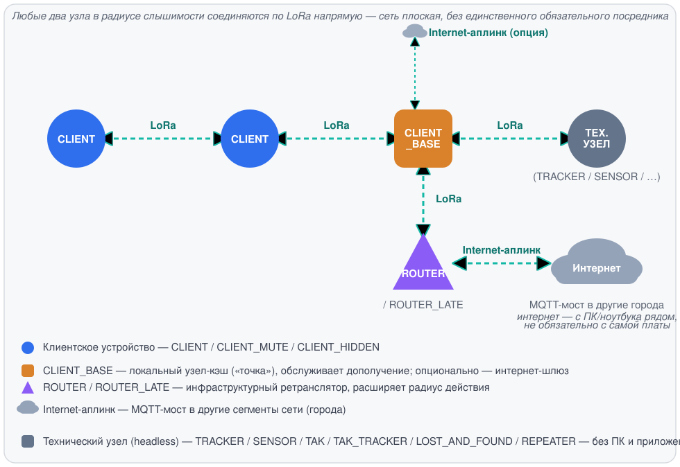
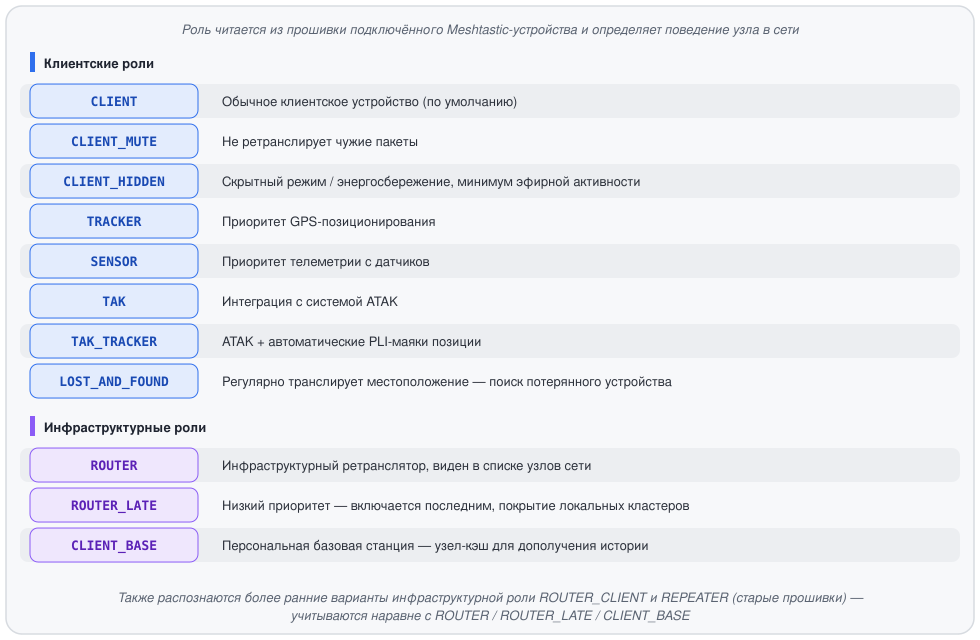

# Meshtastic-FIDO: технология

Meshtastic-FIDO — оффлайн-сеть эхоконференций и личной почты (netmail) в духе
классического FidoNet / редактора GoldED, построенная поверх физического
радиопротокола **Meshtastic (LoRa)**. Сеть не требует интернета и провайдера:
каждый узел хранит сообщения локально, а распространяются они по радиоэфиру
между узлами сети.

> Низкоуровневый бинарный протокол упаковки и фрагментации кадров
> (`PackerEngine`) — собственная разработка и проприетарная часть технологии.
> В этом документе он описан только на уровне назначения и роли в системе,
> без деталей формата кадра, опкодов и алгоритма нарезки.

---

## 1. Типы клиентов

В сети участвует несколько логически разных типов узлов. Физически это одно
и то же TUI-приложение — разница между типами определяется **ролью
устройства** (см. раздел 2) и тем, держит ли узел фоновый сервис раздачи
истории для соседей.

Любые два узла в радиусе слышимости соединяются по LoRa напрямую — сеть плоская,
без иерархии и без единственного обязательного посредника. CLIENT_BASE и ROUTER
выделены на схеме отдельно не потому, что через них обязан идти путь, а потому,
что они дополнительно несут сервисную нагрузку: CLIENT_BASE — кэш истории для
дополучения, ROUTER — приоритетную ретрансляцию, расширяющую охват сети (в т.ч.
до узлов вне прямой досягаемости — через промежуточные ретрансляции по цепочке).

### Обычный клиент (оператор сети)
Стандартный участник: читает и пишет эхопочту и netmail через TUI, подписывается
на эхоконференции и отвечает на сообщения. Работает на любой «клиентской» роли
устройства (`CLIENT`, `CLIENT_MUTE`, `CLIENT_HIDDEN`, `TRACKER`, `SENSOR`,
`TAK`, `TAK_TRACKER`, `LOST_AND_FOUND` — см. раздел 2). Хранит свою переписку
и список подписок в собственной локальной базе. Связывается по LoRa напрямую
с любым другим узлом сети в радиусе слышимости — с таким же обычным клиентом
точно так же, как с `CLIENT_BASE` или `ROUTER`.

### Локальный узел-кэш / «точка» (`CLIENT_BASE`)
То же TUI-приложение, но на устройстве с ролью **`CLIENT_BASE`**, которое
физически остаётся включённым продолжительное время. Такие узлы держат
фоновый сервис раздачи истории эхоконференций и обслуживают дополучение
пропущенных сообщений соседними клиентами, вернувшимися в эфир. Это
ближайший аналог «поинта» в терминологии FidoNet. Выход в интернет для
такого узла не обязателен, но и не запрещён — см. ниже.

### Инфраструктурный узел-ретранслятор (`ROUTER` / `ROUTER_LATE`)
Расширяет радиус действия сети, ретранслируя пакеты дальше, в т.ч. до узлов
вне прямой досягаемости.

### Интернет-аплинк — необязательная возможность любого инфраструктурного узла
Выход в интернет не привязан к конкретной роли: как `ROUTER`/`ROUTER_LATE`,
так и `CLIENT_BASE` могут дополнительно иметь доступ в интернет, наравне с
ретранслятором. Отсутствие интернета не мешает узлу выполнять свою основную
роль (раздача истории для `CLIENT_BASE`, ретрансляция для `ROUTER`).

Мост между разрозненными сегментами сети (например, между городами, где нет
общего радиоэфира) — это отдельная возможность поверх интернет-аплинка,
через встроенный в прошивку Meshtastic MQTT client proxy: узел делегирует
подключение к MQTT-брокеру этому приложению (у платы обычно нет своего
WiFi/IP), а сама плата публикует/принимает эфирные пакеты через тот же
serial-канал. Мост работает СТРОГО НИЖЕ протокола эхоконференций — формат
кадра и фрагментация не меняются вообще, просто пакеты дополнительно
ретранслируются через брокер вместо (или вместе с) радиоэфиром. Требует
одинаковых настроек брокера и ключа канала на обеих сторонах — настраивается
на самой плате (официальное приложение/CLI Meshtastic), не этим приложением.

---

## 2. Роли клиентов (Meshtastic `Config.DeviceConfig.Role`)

Роль читается из прошивки подключённого Meshtastic-устройства и определяет
поведение узла в сети:

### Как роль влияет на поведение сети
- Каждый узел — клиентский или инфраструктурный — самостоятельно хранит свою
  переписку и список подписок в собственной локальной базе. Подписка на
  эхоконференцию — решение самого клиента, а не разрешение, которое нужно
  у кого-то спрашивать.
- Инфраструктурные узлы (`ROUTER`, `ROUTER_LATE`, `CLIENT_BASE`) дополнительно
  держат историю эхоконференций и раздают дополучение пропущенных сообщений
  вернувшимся в эфир соседям. Такой сервис поднимается независимо на каждом
  инфраструктурном узле: клиент не привязан к одному конкретному узлу — если
  один недоступен, историю можно дополучить у любого другого в радиусе.
- Индикатор `[H]`/`[C]` в интерфейсе отражает, ведёт ли себя текущий узел как
  инфраструктурный или как обычный клиент; счётчики видимых соседей
  показывают, сколько вокруг узлов каждого типа.
- Список доступных эхоконференций клиент получает от любого доступного
  инфраструктурного узла — не обязательно от одного и того же.

---

## 3. Передача данных (общий контур)

Сообщения (эхопочта, netmail, служебные команды) перед выходом в эфир
проходят через единый конвейер упаковки и фрагментации (`PackerEngine`),
приводящий их к ограничениям MTU радиоканала LoRa и разбирающий обратно на
приёме — по одному и тому же пути для любых сообщений, без особых случаев.

Сеть децентрализована на уровне доставки: живые сообщения распространяются
широковещательной ретрансляцией по эфиру, без привязки к одному конкретному
узлу. Дополучение пропущенной истории — тоже двустороннее: когда два узла
встречаются в эфире (например, клиент, какое-то время работавший без
доступного инфраструктурного узла, встречает такой узел или другого клиента),
они обмениваются недостающими сообщениями в обе стороны, а не только
«клиент тянет у хаба» — каждый отдаёт то, чего нет у собеседника, и получает
то, чего нет у себя. Обслуживать дополучение может любой доступный
инфраструктурный узел, а не единственный фиксированный.

Помимо самой упаковки и фрагментации, этот же конвейер экономит эфирное время
и устойчив к перегрузке канала: сжатие с учётом специфики протокола, порядок
отправки при заторе эфира, защита от повторной ретрансляции одного и того же
пакета по кругу и компактные представления больших списков истории — как и
формат кадра, детали этих механизмов остаются частью закрытой реализации
`PackerEngine` и здесь не раскрываются.

---

## 4. Подлинность и приватность сообщений

Каждое сообщение подписывается на узле-отправителе собственной парой ключей
приложения (не аппаратным ключом радиомодуля) и генерируется локально при
первом запуске. Любой принимающий узел — включая инфраструктурные,
занимающиеся ретрансляцией и раздачей истории, — независимо проверяет
подпись заново, не полагаясь на чужую отметку о проверке. Если подпись не
сходится, сообщение не отбрасывается тихо, а помечается в интерфейсе как
`[UNVERIFIED]`, чтобы читатель видел: подлинность отправителя не
подтверждена.

Личная переписка (netmail с известным получателем) дополнительно шифруется
отдельной, независимой от подписи парой ключей — по распространённой
практике (тот же принцип, что в PGP/SSH/Signal: ключ подписи и ключ
шифрования не переиспользуются друг для друга). Из этого следует, что
инфраструктурный узел, который кэширует и ретранслирует чужую личную почту,
физически не способен прочитать её тело — у него просто нет приватного
ключа настоящего получателя.

Ключами шифрования узлы обмениваются по схеме TOFU (доверие при первом
использовании, как в SSH/PGP): открытый ключ отправителя прикладывается к
каждому подписанному сообщению, и принимающая сторона запоминает его при
первой встрече. При последующем несовпадении ключ молча не
перезаписывается — это тот же принципиальный компромисс, что и у любой
TOFU-схемы (риск подмены существует только в момент самого первого
знакомства двух узлов).
