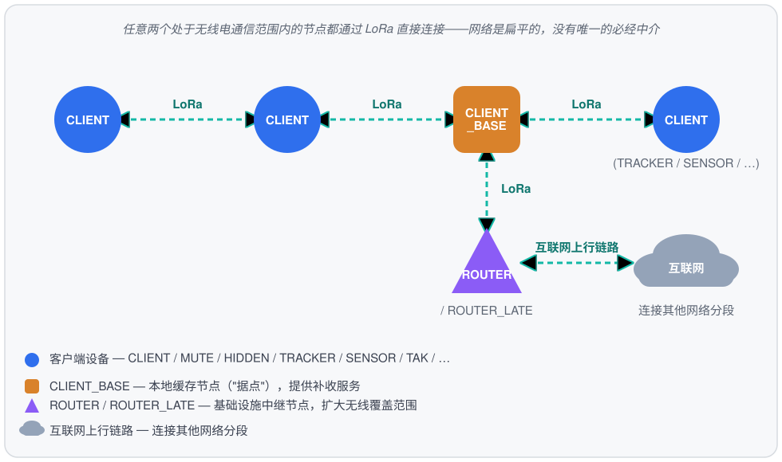

# Meshtastic-FIDO：技术说明

Meshtastic-FIDO 是一个基于经典 FidoNet / GoldED 编辑器理念、构建在
**Meshtastic (LoRa)** 物理无线协议之上的离线信区（echo-conference）与私人
邮件（netmail）网络。该网络不需要互联网或运营商：每个节点在本地保存消息，
消息通过无线电波在节点之间传播。

> 底层的二进制帧打包与分片协议（`PackerEngine`）是我们自主研发、且属于
> 本技术专有（proprietary）的部分。本文档仅在用途和系统角色层面进行描述，
> 不涉及帧格式、操作码或分片算法的细节。

---

## 1. 客户端类型

网络中存在若干逻辑上不同的节点类型。物理上它们是同一个 TUI 应用程序——
类型之间的区别由**设备角色**决定（见第 2 节），以及该节点是否运行向邻近
节点分发历史消息的后台服务。

任意两个处于无线电通信范围内的节点都通过 LoRa 直接连接——网络是扁平的，
没有层级结构，也没有唯一的必经中介。图中之所以单独标出 CLIENT_BASE 和
ROUTER，并非因为流量必须经过它们，而是因为它们额外承担了服务职能：
CLIENT_BASE 保存历史消息缓存供补收使用，ROUTER 执行优先中继，扩大网络
覆盖范围（包括通过一连串中继节点到达直接无法触及的节点）。

### 普通客户端（网络用户）
标准参与者：通过 TUI 阅读和撰写信区邮件与 netmail，订阅信区并回复消息。
可运行在任何"客户端类"设备角色上（`CLIENT`、`CLIENT_MUTE`、`CLIENT_HIDDEN`、
`TRACKER`、`SENSOR`、`TAK`、`TAK_TRACKER`、`LOST_AND_FOUND`——见第 2 节）。
在自己的本地数据库中保存自己的信件和订阅列表。通过 LoRa 与通信范围内的
任何其他节点直接连接——与另一个普通客户端连接的方式，同与 `CLIENT_BASE`
或 `ROUTER` 连接完全一样。

### 本地缓存节点 /「据点」(`CLIENT_BASE`)
同一个 TUI 应用程序，但运行在角色为 **`CLIENT_BASE`** 的设备上，该设备
长时间保持物理开机状态。这类节点运行后台服务，分发信区历史消息，并为
重新上线的邻近客户端提供缺失消息的补收。这是 FidoNet 术语中「据点」
（point）概念最接近的对应物。该节点是否接入互联网是可选的，并非必须——
见下文。

### 基础设施中继节点 (`ROUTER` / `ROUTER_LATE`)
通过继续中继数据包来扩大网络的无线覆盖范围，包括到达直接无法触及的节点。

### 互联网上行链路——任何基础设施节点的可选能力
接入互联网并不绑定于特定角色：无论是 `ROUTER`/`ROUTER_LATE` 还是
`CLIENT_BASE`，都可以额外接入互联网，与中继节点地位相同。没有互联网并不
妨碍节点履行其主要职责（`CLIENT_BASE` 的历史分发、`ROUTER` 的中继）。

在互联网上行链路基础上，还有一项独立能力：连接不同网络分段（例如，两个
没有共同无线电覆盖范围的城市）——通过 Meshtastic 固件内置的 MQTT 客户端
代理（MQTT client proxy）实现：节点把与 MQTT 代理服务器的实际连接委托给
本应用程序（板卡本身通常没有自己的 WiFi/IP），板卡则通过同一个串口通道
发布/接收空口数据包。该桥接机制严格运行在信区协议之下——帧格式和分片逻辑
完全不变，数据包只是额外通过代理服务器转发（而非仅通过无线电，或与之并
存）。两端需要配置相同的代理服务器地址和信道密钥——在板卡本身上配置（通过
官方 Meshtastic 应用程序/CLI），而非本应用程序。

---

## 2. 客户端角色（Meshtastic `Config.DeviceConfig.Role`）

角色从所连接的 Meshtastic 设备固件中读取，并决定该节点在网络中的行为：

### 角色如何影响网络行为
- 每个节点——无论客户端类还是基础设施类——都独立地在自己的本地数据库中
  保存自己的信件和订阅列表。订阅某个信区是客户端自己的决定，而不是需要
  向他人请求的许可。
- 基础设施节点（`ROUTER`、`ROUTER_LATE`、`CLIENT_BASE`）额外保存信区历史
  消息，并为重新上线的邻近节点提供缺失消息的补收服务。该服务在每个基础
  设施节点上独立运行：客户端并不绑定于某一个特定节点——如果其中一个不可
  用，仍可从通信范围内的任何其他节点补收历史。
- 界面中的 `[H]`/`[C]` 指示符反映当前节点表现为基础设施节点还是普通客户
  端；可见邻居计数器显示周围各类型节点的数量。
- 客户端从任意可用的基础设施节点获取可用信区列表——不一定总是同一个。

---

## 3. 数据传输（总体概述）

消息（信区邮件、netmail、控制指令）在发往空口之前，都会经过统一的打包与
分片流水线（`PackerEngine`）——将其限制在 LoRa 无线信道的 MTU 范围内，
并在接收端重新组装——所有消息都走同一条路径，没有特殊分支。

该网络在投递层面是去中心化的：实时消息通过空口广播中继传播，不依赖于
任何一个特定节点。缺失历史消息的补收同样是双向的：当两个节点在空口相遇
时（例如，一个客户端在一段时间内没有可用的基础设施节点，之后遇到了这样
的节点，或遇到了另一个客户端），双方会把对方缺失的消息双向补齐给对方——
而不仅仅是「客户端向据点单向拉取」。补收服务可以由任意一方提供，并不绑定
于某个固定节点。

除了打包与分片本身之外，同一条流水线还负责节省空口时间并在信道拥堵时保持
稳健：面向协议特点的压缩、信道拥堵时的发送顺序安排、防止同一数据包被无限
循环转发的保护机制，以及针对大型历史列表的紧凑表示方式。与帧格式一样，这
些机制的具体细节属于 `PackerEngine` 封闭实现的一部分，本文档不作披露。

---

## 4. 消息的真实性与隐私

每条消息都在发送节点上使用应用自身的密钥对进行签名（并非无线电模块的
硬件密钥），该密钥对在首次启动时于本地生成。任何接收节点——包括负责中继
和历史缓存的基础设施节点——都会独立重新验证签名，而不是信任别处已经做过
的验证结果。如果签名校验不通过，消息不会被静默丢弃，而是在界面中标记为
`[UNVERIFIED]`，提醒读者：发送者的真实性尚未得到确认。

私人邮件（有明确收件人的 netmail）会额外使用另一组独立于签名密钥的密钥
对进行加密——遵循通用实践（与 PGP/SSH/Signal 相同的原则：签名密钥与加密
密钥不会相互复用）。由此带来的结果是：负责缓存和转发他人私人邮件的基础
设施节点，物理上无法读取其正文——因为它根本没有真正收件人的私钥。

节点之间通过 TOFU（首次使用时建立信任，与 SSH/PGP 相同）方式交换加密
密钥：发送者的公钥会随每条已签名的消息一并送达，接收方在第一次见到时
将其记住。此后如遇到不一致，密钥不会被静默覆盖——这是任何 TOFU 方案都
存在的固有取舍（伪装风险只存在于两个节点第一次相遇的那一刻）。
